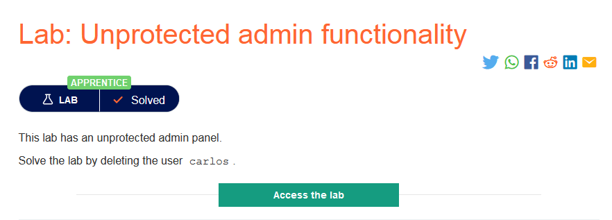
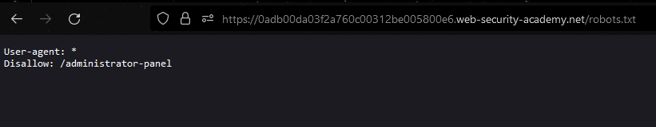
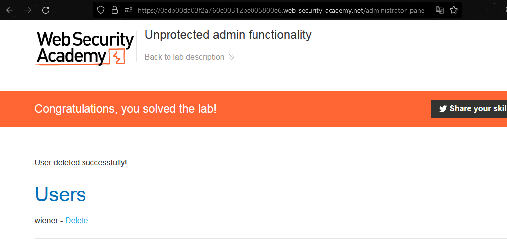

### Mô tả
> Phòng thí nghiệm này có admin panel không đươc bảo vệ.
>  Giải quyết phòng thí nghiệm bằng cách xóa người dùng carlos. 
### Giải quyết
- Kiểm tra sự tồn tại và nội dung file `robots.txt`. 
>`Robots.txt là một tệp văn bản đơn giản nằm trong thư mục gốc của trang web. Nó thông báo cho các robot được điều động bởi các công cụ tìm kiếm những trang nào được phép thu thập thông tin và những trang nào không được phép.`

- Mô tả phòng thí nghiệm cho biết "admin panel không đươc bảo vệ". Vì thế để xác định được đường dẫn đến trang admin, trước tiên kiểm tra file `robots.txt`

- Vì admin panel không được bảo vệ mà chỉ bị chặn quét từ các bot ủa công cụ tìm kiếm nên từ đường dẫn trên có thể truy cập tới và xóa tài khoản carlos

###### Solved!