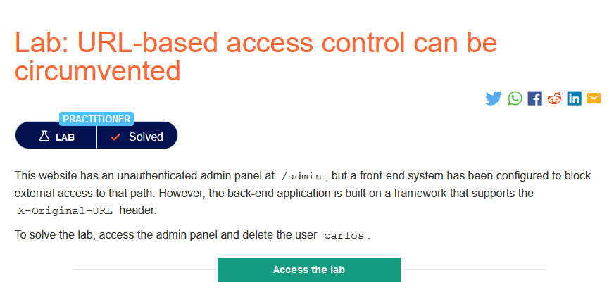
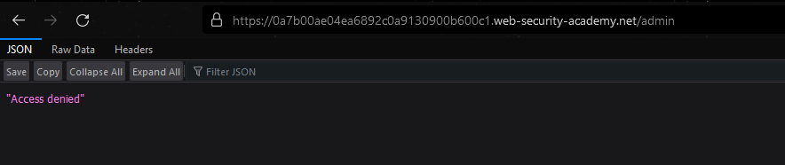
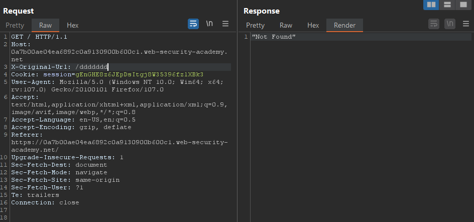
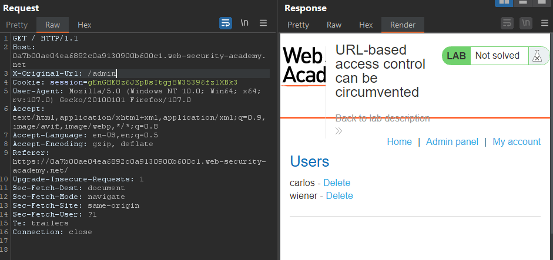
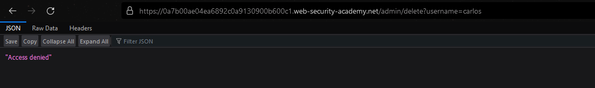
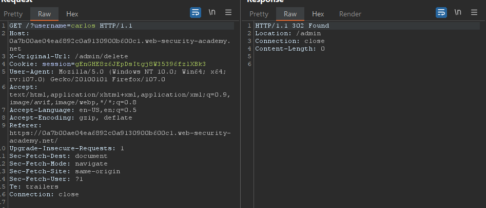
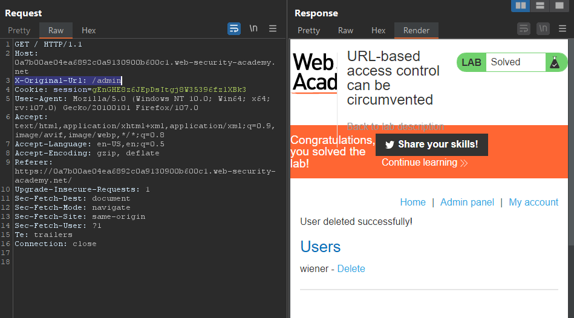

### Mô tả
> Trang web này có bảng điều khiển quản trị chưa được xác thực tại / admin, nhưng hệ thống giao diện người dùng đã được định cấu hình để chặn truy cập từ bên ngoài vào đường dẫn đó. Tuy nhiên, back-end được xây dựng trên một framework hỗ trợ tiêu đề X-Original-URL.
Để giải quyết phòng thí nghiệm, hãy truy cập bảng điều khiển quản trị và xóa người dùng carlos
### Giải quyết 
- Truy cập vào `Admin panel` đã bị chặn 

- Tuy nhiên mô tả cho biết back-end của trang web hỗ trợ tiêu đề X-Original-URL (1 HTTP header được sử dụng để ghi đè URL trong request)
- Để kiểm tra trang web có hỗ trợ X-Original-URL hay không, có thể ghi đè 1 url bất kỳ không tồn tại. Nếu kết quả trả về mã trạng thái HTTP 404 hoặc thông báo "Not Found" trong nội dung phản hồi thì tức là nó được hỗ trợ.

- Tiếp theo thử truy cập vào /admin

- Có thể tới `/admin` bằng cách sử dụng `Request in browser` sau đó thực hiện xóa tài khoản `carlos` 

- Thực hiện xóa tài khoản `carlos` bằng cách đi tới `/admin/deleter` và thêm tham số `username=carlos` 

- Follow redirection response trả về sẽ là `Access denied` tuy nhiên quay lại trang admin thì tải khoản người dùng carlos đã bị xóa

###### Solved!
