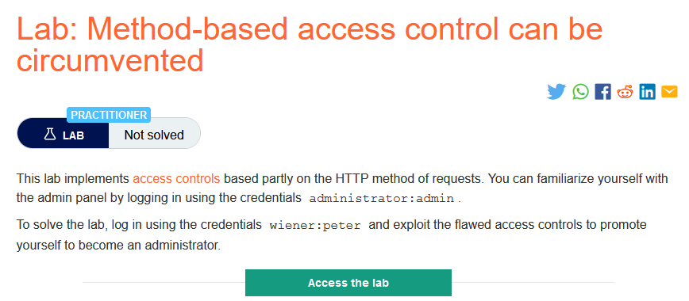
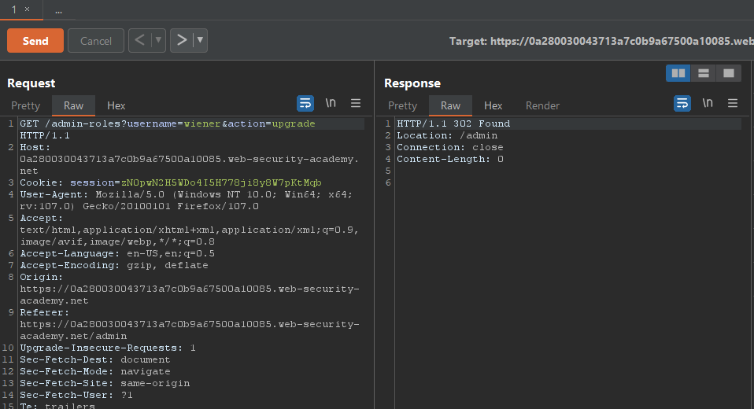
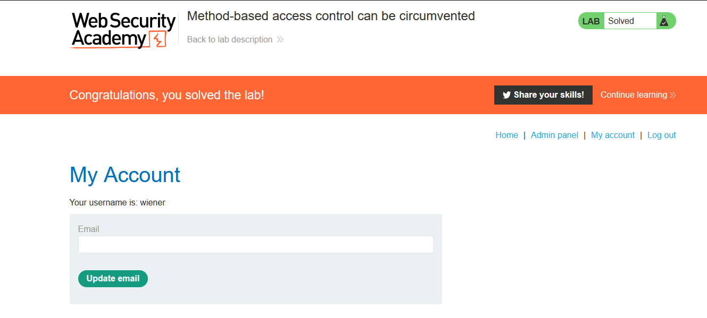

### Mô tả
> Phòng thí nghiệm này triển khai các kiểm soát truy cập dựa một phần trên phương thức HTTP của các yêu cầu. Bạn có thể tự làm quen với bảng quản trị bằng cách đăng nhập bằng tài khoản quản trị viên administrator: admin.
Để giải quyết phòng thí nghiệm, hãy đăng nhập bằng cách sử dụng chứng chỉ wiener: peter và khai thác các kiểm soát truy cập còn thiếu sót để thăng cấp bản thân trở thành quản trị viên.
### Giải quyết
- Sử dụng tài khoản administrator nâng cấp tài khoản carlos lên admin.
- Chuyển request upgrade đó sang tab Repeater.
- Phòng thí nghiệm này chỉ kiểm soát truy cập dựa một phần vào HTTP method và để giải quyết lab cần dùng tài khoản wiener để nâng cấp chính nó lên admin.
- Đăng nhập tài khoản wiener.
- Thay session của tài khoản wiener đang đăng nhập vào request bên tab Repeater -> đổi giá trị username thành wiener -> Change request method -> Send request.

- Follow redirection.

###### Solved!