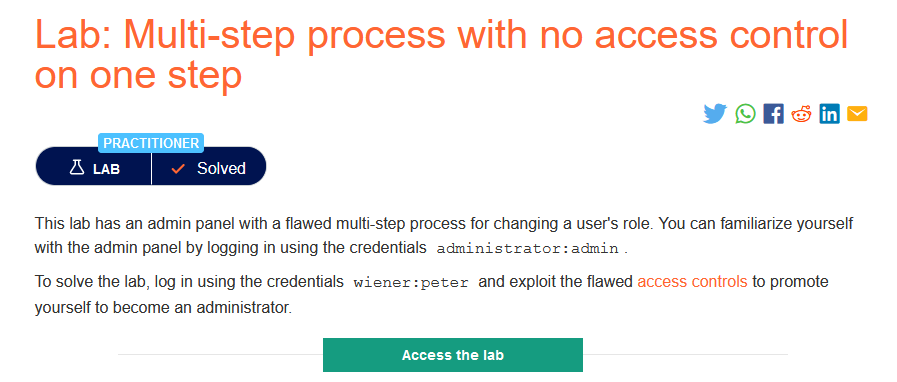
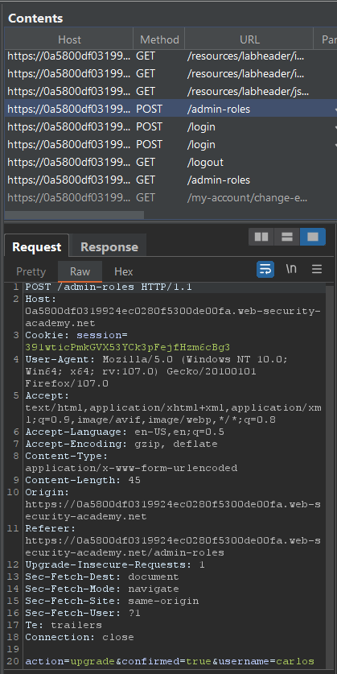
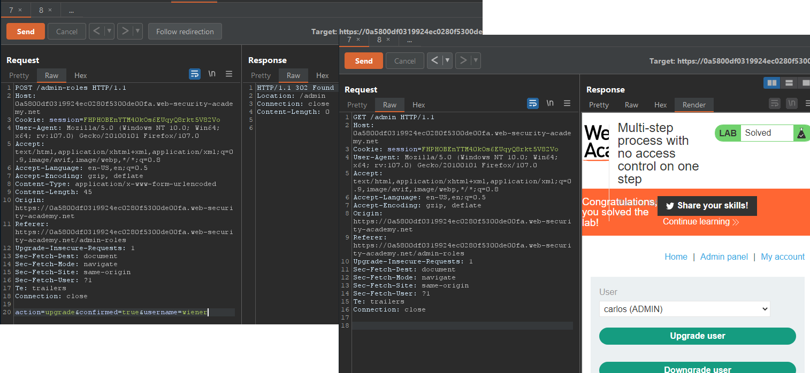

### Mô tả 
> Phòng thí nghiệm này có một bảng điều khiển dành cho quản trị viên với một quy trình gồm nhiều bước có sai sót để thay đổi vai trò của người dùng. Bạn có thể tự làm quen với bảng tài khoản quản trị administrator:admin.
Để giải quyết phòng thí nghiệm, hãy đăng nhập bằng cách sử dụng tài khoản wiener:peter và khai thác các điều khiển truy cập còn thiếu sót để thăng cấp bản thân trở thành quản trị viên
### Giải quyết
- Đăng nhập tài khoản quản trị và năng cấp tài khoản carlos lên admin. Quy trình thay đổi vai trò này diễn ra với 2 bước: yêu cầu thay đổi vai trò người dùng -> xác nhận (chính là bước không được kiểm soát).

- Chuyển request xác nhận sang tab Repeater, sau đó đăng nhập với tài khoản wiener. Thay session đăng nhập của tài khoản wiener và giá trị username -> Send request -> Follow redirection 

###### Solved!