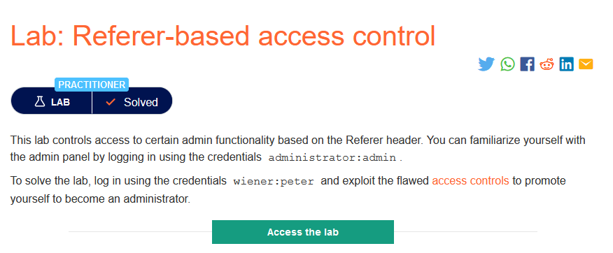
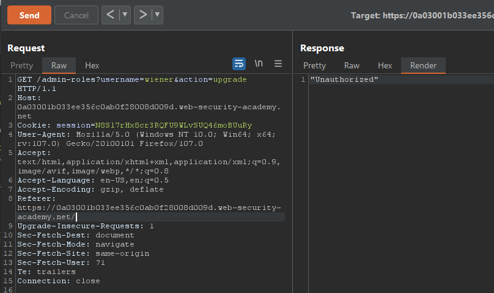
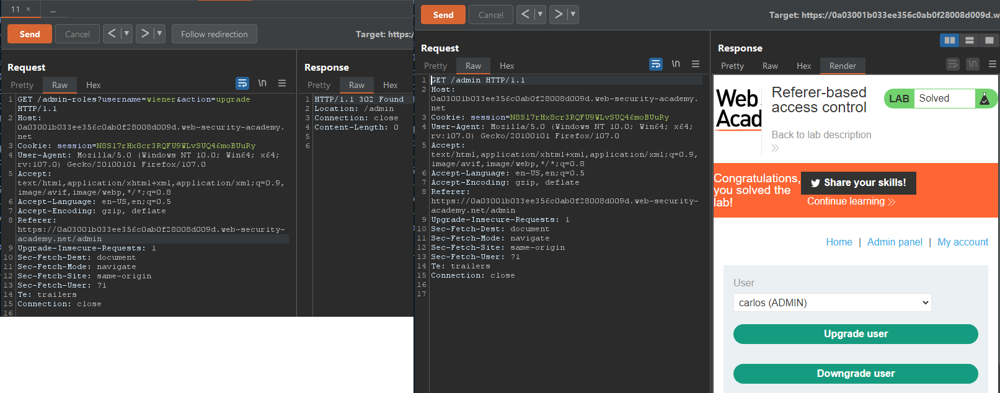

### Mô tả
> Phòng thí nghiệm kiểm soát quyền truy cập vào một số chức năng quản trị dựa trên Referer header. Bạn có thể tự làm quen với bảng quản trị bằng cách đăng nhập bằng administrator:admin.
Để giải quyết phòng thí nghiệm, hãy đăng nhập bằng cách sử dụng chứng chỉ wiener:peter và khai thác các kiểm soát truy cập còn thiếu sót để thăng cấp bản thân trở thành quản trị viên.
### Giải quyết
- Ở lab này khi thay đổi vai trò người dùng, trang web chỉ kiểm soát quyền truy cập dựa vào Referer header. Nếu Referer header chứa /admin thì yêu cầu được cho phép.
- Sử dụng tài khoản quản trị để thay đổi vai trò người dùng carlos. Sau khi có request, chuyển nó sang Burp Repeater.
- Đăng nhập với tài khoản wiener -> thay giá trị session vào request và sửa giá trị username thành wiener.
- Lúc này nếu Referer header không có /admin yêu cầu sẽ không được phép.

- Referer header có /admin yêu cầu được cho phép 

###### Solved!
