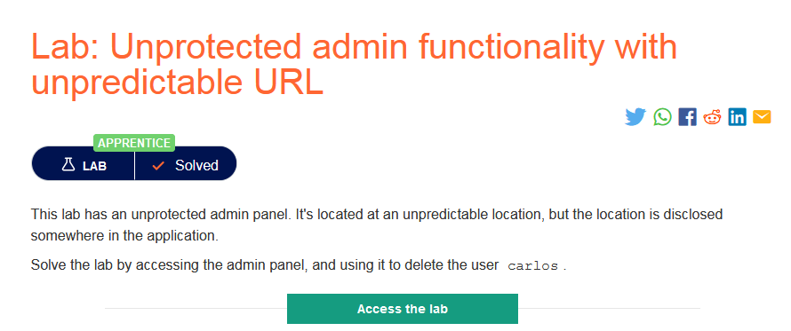
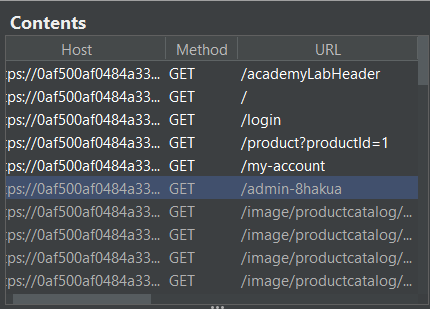
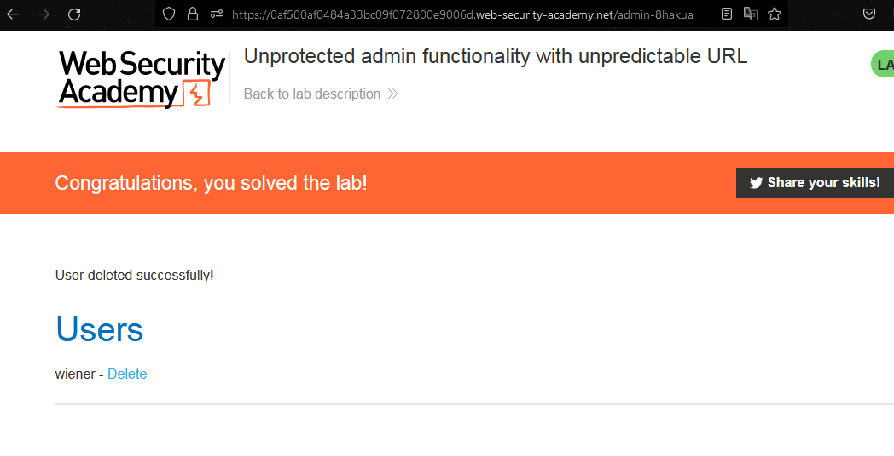

### Mô tả
> Lab này có bảng quản trị không được bảo vệ. Nó nằm ở một vị trí không thể đoán trước, nhưng vị trí được tiết lộ ở đâu đó trong ứng dụng.
>
> Giải quyết phòng thí nghiệm bằng cách truy cập bảng quản trị và sử dụng nó để xóa người dùng carlos.
### Giải quyết
- Trước hết, kiểm tra file robots.txt -> Not found 
- Tiếp đến, sử dụng proxy của burp, sử dụng các chức năng của web và theo dõi Site map trong Burpsuite

`-> đường dẫn đến trang admin`
- Truy cập theo đường dẫn và xóa tài khoản carlos.

###### Solved!   