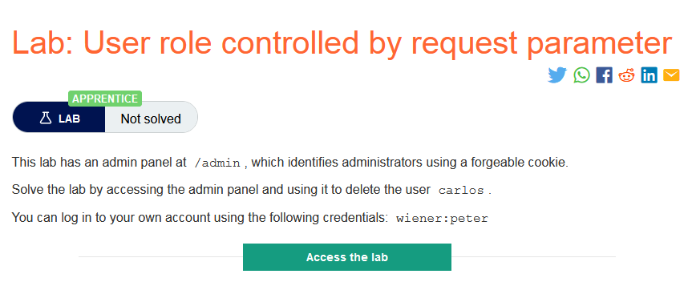
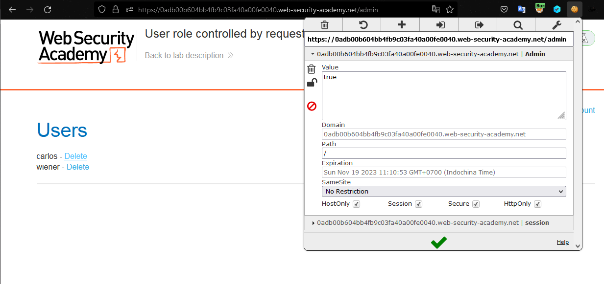

### Mô tả
>  Phòng thí nghiệm này có bảng quản trị tại /admin, xác định quản trị viên bằng cách sử dụng cookie có thể giả mạo.
>
> Giải quyết phòng thí nghiệm bằng cách truy cập bảng quản trị và sử dụng nó để xóa người dùng carlos.
>
> Bạn có thể đăng nhập vào tài khoản của riêng mình bằng thông tin đăng nhập sau: wiener:peter 
### Giải quyết 
- Trang web sử dụng cookie để kiểm tra quyền của user truy cập đến trang `/admin`
- Khi đăng nhập với tài khoản `wiener`, vì là người dùng thông thường nên cookie `Admin` có giá trị là `false` nên không có quyền truy cập `/admin`
- Thay đổi giá trị cookie Admin `false -> true` 

- Xóa tài khoản `carlos`

###### Solved!