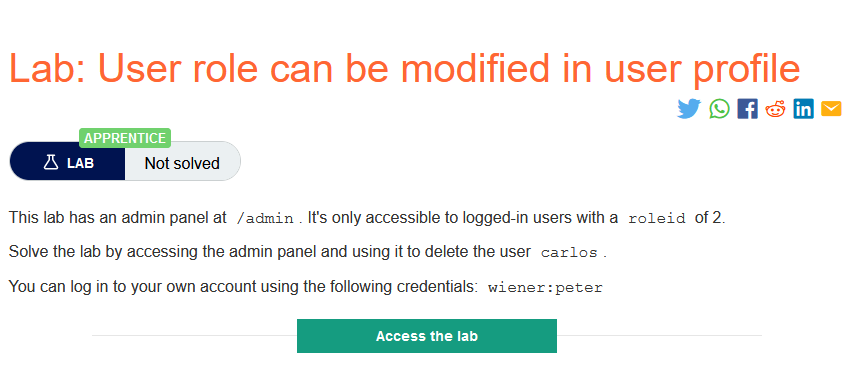
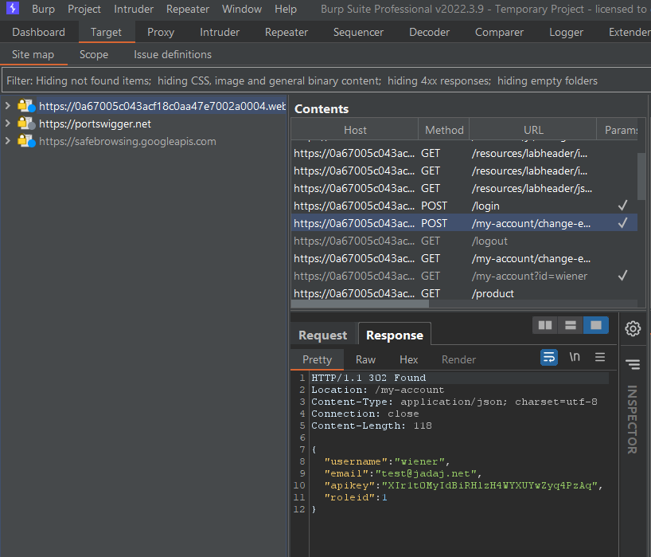
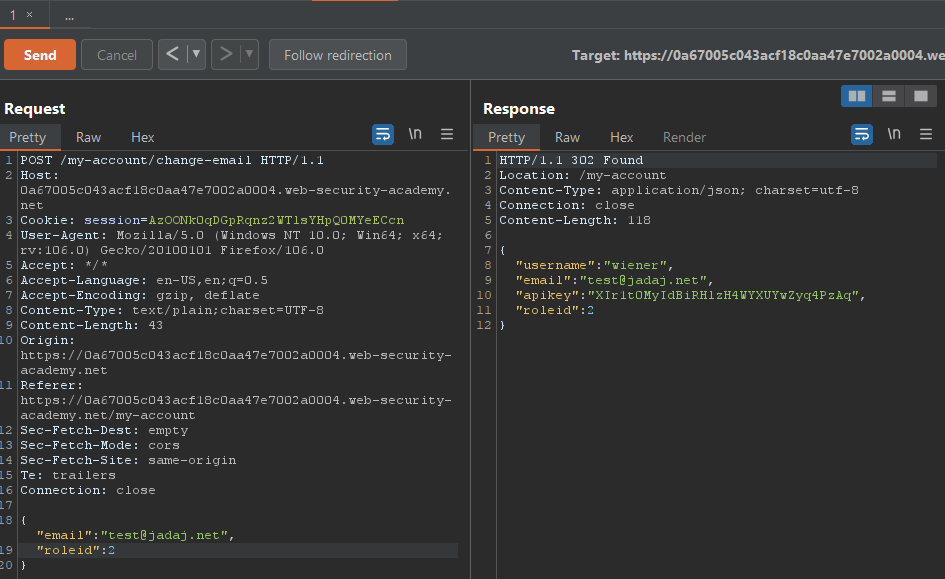
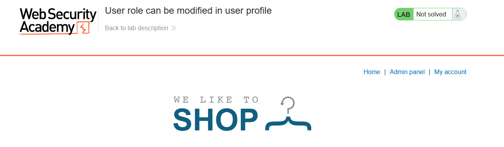

### Mô tả
> Phòng thí nghiệm này có một bảng quản trị tại / admin. Nó chỉ có thể truy cập được đối với người dùng đã đăng nhập với roleid là 2.
> Giải quyết phòng thí nghiệm bằng cách truy cập bảng quản trị và sử dụng nó để xóa carlos người dùng.
> Bạn có thể đăng nhập vào tài khoản của mình bằng thông tin đăng nhập sau: wiener: peter
### Giải quyết
- Để truy cập được đến trang quản trị thì người dùng cần có `roleid` là 2, vì vậy trước tiên đi thử hết các chức năng để xác định vị trí của `roleid`
- Sau đó kiểm tra trong `Site map`, khi thực hiện thay đổi email xuất hiện tham số `roleid` 

- Chuyển request sang tab Repeater và thêm `"roleid":2` cùng với email cần thay đổi và gửi request đi.

- Đã có Admin Panel

- Truy cập Admin Panel và xóa tài khoản carlos để hoàn thành lab.
###### Solved! 