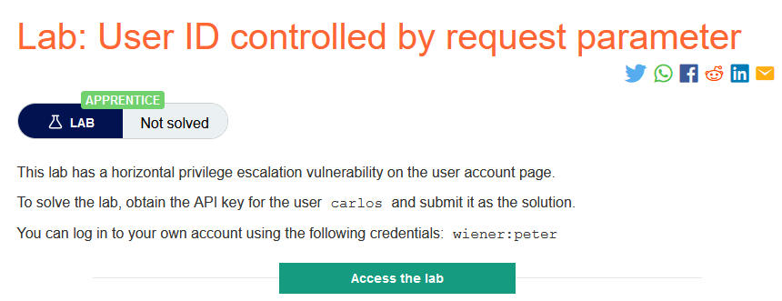
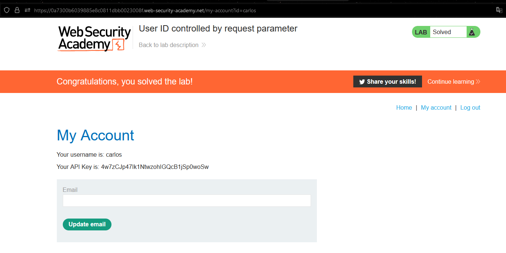

### Mô tả
> Phòng thí nghiệm này có lỗ hổng kiểm soát truy cập theo chiều ngang trên trang tài khoản người dùng.
Để giải phòng thí nghiệm, hãy lấy khóa API cho carlos của người dùng và gửi nó dưới dạng giải pháp.
Bạn có thể đăng nhập vào tài khoản của mình bằng thông tin đăng nhập sau: wiener: peter
### Giải quyết
- Khi sau khi đăng nhập thành công vào trang `My account` trên địa chỉ url sẽ xuất hiện `id=wiener`.Mà "phòng thí nghiệm này có lỗ hổng bảo mật theo chiều ngang trên trang tài khoản người dùng" tức là từ đây chỉ cần sửa đổi giá trị của `id` thành `carlos` là có thể truy cập được và trang `My account` của `carlos`.
- Lấy API key và submit để hoàn thành lab.

