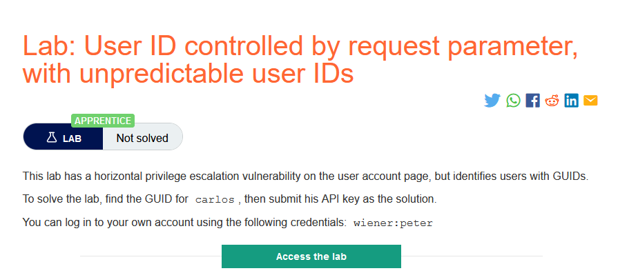
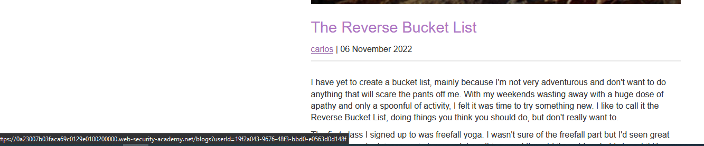
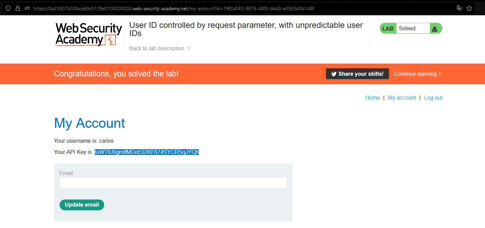

### Mô tả
>Phòng thí nghiệm này có lỗ hổng kiểm soát truy cập theo chiều ngang trên trang tài khoản người dùng, nhưng xác định người dùng bằng GUID.
Để giải quyết phòng thí nghiệm, hãy tìm GUID cho carlos, sau đó gửi khóa API của anh ấy làm giải pháp.
Bạn có thể đăng nhập vào tài khoản của mình bằng thông tin đăng nhập sau: wiener: peter
### Giải quyết 
- Phòng thí nghiệm này có lỗ hổng kiểm soát truy cập theo chiều ngang ở trang `My account` nhưng lại sử dụng giá trị của `userid`.
- Sau khi mày mò từ các post có thể tìm ra giá trị `userid` của `carlos`

- Truy cập trang tài khoản người dùng của carlos, lấy API key và submit

###### Solved!