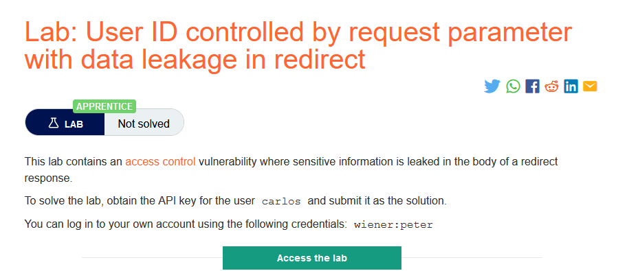
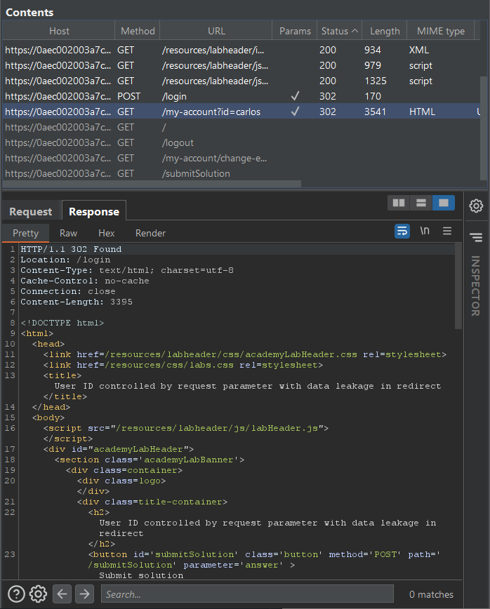
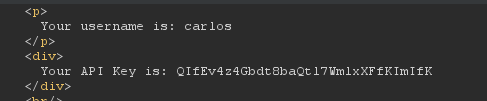

### Mô tả
> Phòng thí nghiệm này chứa lỗ hổng kiểm soát truy cập nơi thông tin nhạy cảm bị rò rỉ trong nội dung của phản hồi chuyển hướng.
Để giải phòng thí nghiệm, hãy lấy khóa API cho carlos của người dùng và gửi nó dưới dạng giải pháp.
Bạn có thể đăng nhập vào tài khoản của mình bằng thông tin đăng nhập sau: wiener: peter
### Giải quyết
- Trước hết thử thay đổi giá trị `id` từ `wiener` thành `carlos` thì trang web chuyển hướng luôn đến trang đăng nhập.
- Nhưng mô tả cho biết "thông tin nhạy cảm bị rò rỉ trong nội dung của phản hồi chuyển hướng" -> kiểm tra trong Site map -> thông tin phản hồi khi truy cập trang `My account` bằng tài khoản `carlos`

- Lấy API key của carlos và submit để hoàn thành lab.

###### Solved! 