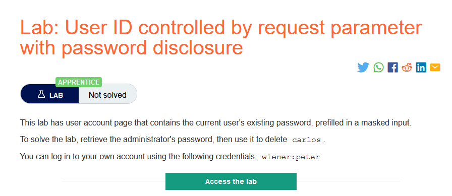

### Mô tả 
> Phòng thí nghiệm này có trang tài khoản người dùng chứa mật khẩu hiện tại của người dùng hiện tại, được điền sẵn trong một đầu vào được che giấu.
Để giải quyết phòng thí nghiệm, hãy truy xuất mật khẩu của quản trị viên, sau đó sử dụng mật khẩu đó để xóa carlos.
Bạn có thể đăng nhập vào tài khoản của mình bằng thông tin đăng nhập sau: wiener: peter
### Giải quyết 
- Trước hết trang web vẫn tồn tại lỗ hổng kiếm soát truy cập theo chiều ngang, nên từ trang `My account` của `wiener` có thể truy cập đến trang `My account` của `administrator` bằng cách sửa đổi tham số `id`

- Vì trang `My account` đã điền sẵn giá trị password của tài khoản trong form với `type="password"` nên giá trị của password đã bị che đi nhưng vẫn có thể dễ dàng lấy được nó chỉ bằng cách đơn giản là xem source.

- Sau khi lấy được password của administrator việc còn lại đơn giản là đăng nhập vào và xóa tài khoản carlos để hoàn thành lab.

###### Solved!
