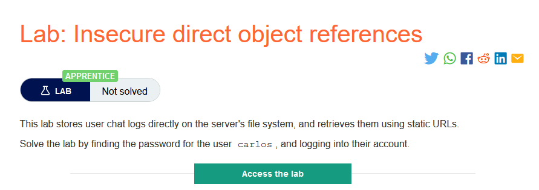
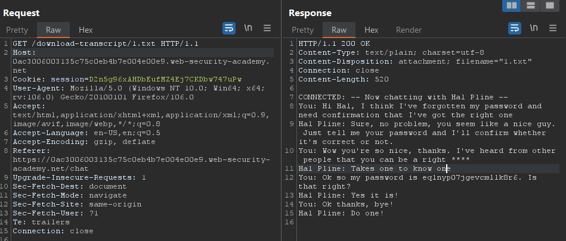
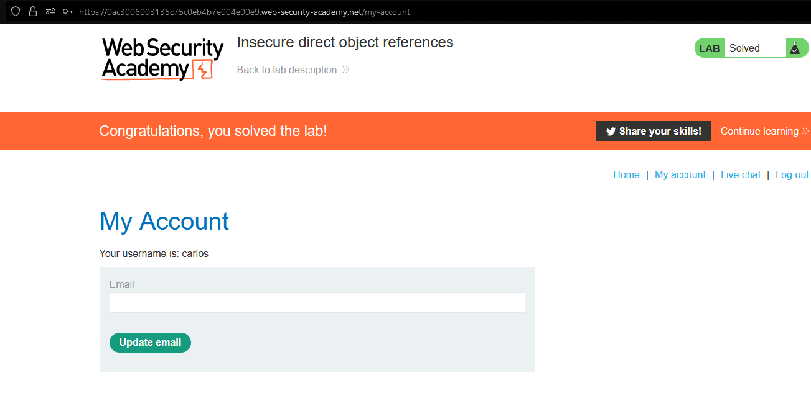

### Mô tả
> Phòng thí nghiệm này lưu trữ nhật ký trò chuyện của người dùng trực tiếp trên hệ thống tệp của máy chủ và truy xuất chúng bằng các URL tĩnh.
Giải quyết phòng thí nghiệm bằng cách tìm mật khẩu của carlos người dùng và đăng nhập vào tài khoản của họ.
### Giải quyết
- Sau khi thử các chức năng của `Live chat`, khi chọn `View transcript` sẽ tải 1 file hội thoại về và bắt đầu lại là `2.txt`. Tiếp đến nhìn vào `Site map`, có 1 request đến file chat `2.txt`.
- Chuyến request sang tab Repeater và thử file chat đầu tiên `1.txt` và thành công đọc được 1 đoạn chat khác.

- Mật khẩu trong đoạn chat kia có thể là của `carlos`, thử dùng nó login vào tài khoản `carlos` 

###### Solved!
