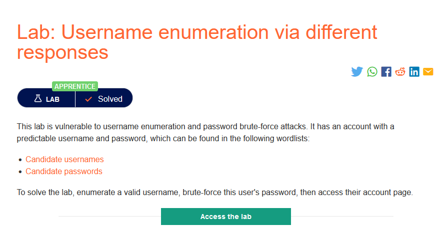
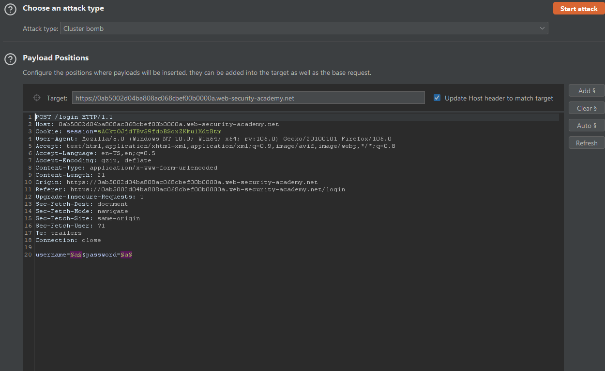
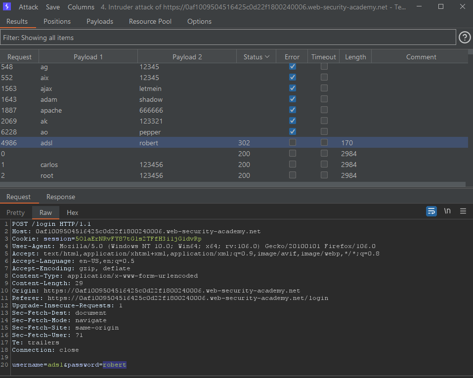
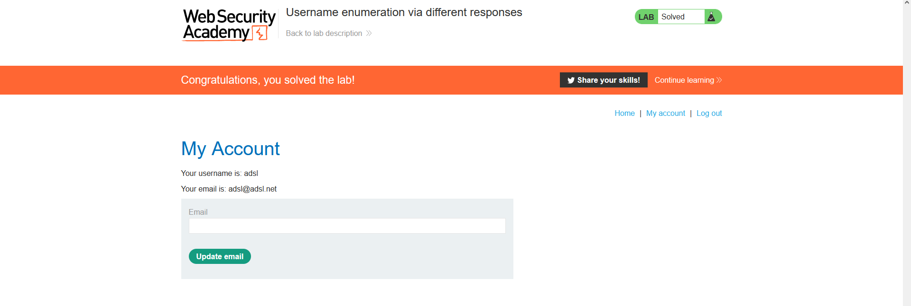

### Mô tả
> Phòng thí nghiệm này dễ bị tấn công brute-force tên người dùng và mật khẩu. Nó có một tài khoản với tên người dùng và mật khẩu có thể dự đoán được, có thể tìm thấy trong danh sách từ sau:
    > [Candidate usernames](https://portswigger.net/web-security/authentication/auth-lab-usernames)
    > [Candidate passwords](https://portswigger.net/web-security/authentication/auth-lab-passwords)
> Để giải phòng thí nghiệm, hãy liệt kê một tên người dùng hợp lệ, brute-force mật khẩu của người dùng này, sau đó truy cập trang tài khoản của họ.
### Giải quyết
- Form đăng nhập của trang web không được xác thực vì thế nó dễ bị tấn công brute-force. 
- Giải quyết lab bằng cách sử dụng intruder trong burpsuite brute-force tên đăng nhập và mật khẩu với danh sách đã được cung cấp. 
- Bắt request và gửi đến intruder.
- Sử dụng attack type: Cluster Bomb và add payload vào 2 biến giá trị của username và password.

- Tab payloads: lần lượt paste danh sách username vào simpl. list payload 1 và danh sách password vào simple list payload 2. 
- Start attack.
- Sau khi hoàn thành tấn công sẽ ở cột status sẽ có 2 giá trị trả về là 200 và 302.
- Nếu đăng nhập không thành công trang web sẽ không chuyển hướng đến trang tiếp theo và trả về giá trị 200 tức là trạng thái thành công
- Còn khi đăng nhập thành công trang web chuyển hướng đến trang tiếp theo, do không cài follow redirections nên giá trị trả về là 302.

- Đăng nhập với username và password tìm được

###### Solved!

