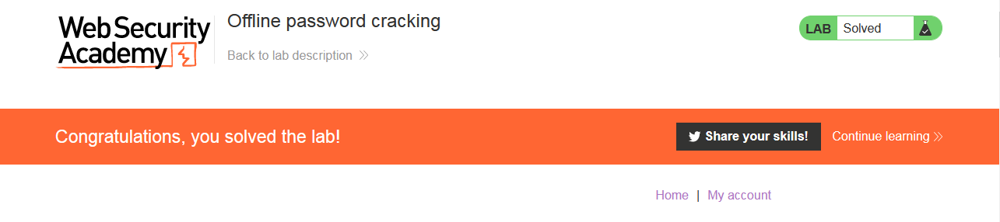

### Giải quyết 
- Phòng thí nghiệm lưu hàm băm mật khẩu người dùng trong cookie và nó chứa lỗ hổng XSS trong chức năng nhận xét. 
- Trước hết sẽ sử dụng tài khoản được cung cấp để phân tích cookie được lưu trữ và vị trí trường chứa lỗ hổng XSS.
- Đầu tiên, phân tích cookie:

- Vị trí chứa lỗ hổng XSS: trường nhận xét - Comment

- Để lấy được cookie của người dùng khác, tiếp theo cần inject 1 payload chuyển hướng người dùng kèm cookie đến 1 web khác mà mình có thể kiểm soát được nhật ký truy cập. Ở đây có exploit server của Burpsuite. Payload: ``
- Ở tài khoản hiện tại khi quay trở lại blog sẽ bị chuyển hướng sang server exploit

- Xem nhật ký truy cập của exploit server có thể thấy 2 người dùng đã bị chuyển hướng 1 là của tài khoản được cung cấp vừa truy cập, 2 là của carlos.
 
- Giải mã cookie lấy mật khẩu tài khoản carlos và hoàn thành nốt yêu cầu của lab.

###### Solved!