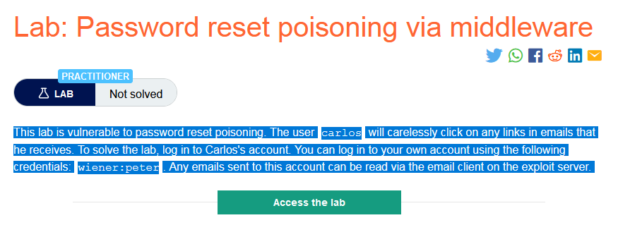
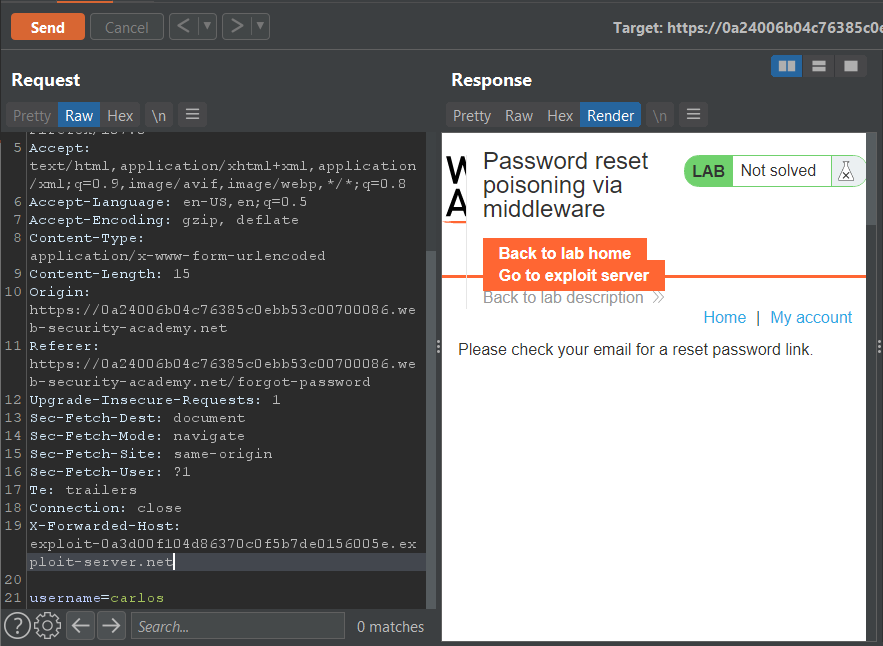
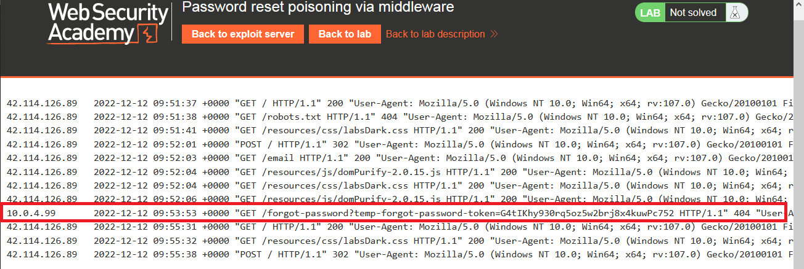
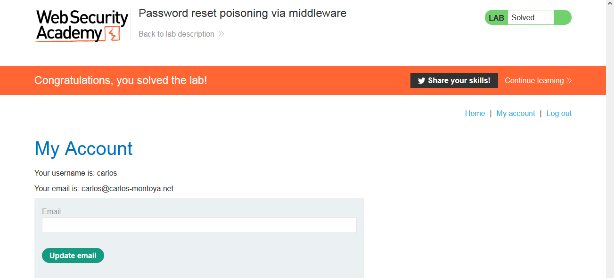

### Mô tả
> Phòng thí nghiệm này dễ bị nhiễm độc khi đặt lại mật khẩu. Người dùng carlos sẽ bất cẩn nhấp vào bất kỳ liên kết nào trong email mà anh ta nhận được. Để giải quyết phòng thí nghiệm, hãy đăng nhập vào tài khoản của Carlos. Bạn có thể đăng nhập vào tài khoản của mình bằng thông tin đăng nhập sau: wiener:peter. Bất kỳ email nào được gửi đến tài khoản này đều có thể được đọc qua ứng dụng email trên máy chủ khai thác.
### Giải quyết
- Phòng thí nghiệm chứa lỗ hổng trong chức năng đặt lại mật khẩu. Vì thế trước tiên phân tích chức năng này bằng cách quên mật khẩu tài khoản wiener.
- Sau khi bấm quên mật khẩu và nhập tài khoản wiener, bên exploit server sẽ nhận được 1 email chứa liên kết đến trang thay đổi mật khẩu mới chứa `temp-forgot-password-token`. Nó được tạo ra và thay đổi theo mọi yêu cầu bất kể yêu cầu trước đó có được sử dụng hay không.
- Nhưng nó được chứa trong URL, vì vậy nếu yêu cầu có thể được thao tác để trỏ đến exploit server, nó sẽ được ghi vào nhật ký máy chủ. 
- Sau khi tìm kiếm trên [developer.mozilla.org](https://developer.mozilla.org/en-US/docs/Web/HTTP/Headers), `X-Forwarded-Host` sẽ được sử dụng để trỏ đến exploit server tức là vì carlos luôn bấm vào bất kỳ liên kết nào anh ta nhận được nên khi carlos bấm vào link đặt lại mật khẩu được gửi về mail, yêu cầu sẽ được chuyển đến exploit server thay vì trang đặt lại mật khẩu ban đầu. Từ đó có thể lấy được `temp-forgot-password-token` trong nhật ký máy chủ và thay đổi mật khẩu của carlos.
- Thêm header `X-Forwarded-Host` khi gửi yêu cầu thay đổi mật khẩu tài khoản carlos.

- carlos nhận được mail sẽ bấm vào liên kết đến exploit server và yêu cầu sẽ được ghi lại trong nhật ký máy chủ.

- Truy cập liên kết trong mail wiener tới trang đặt mật khẩu mới và thay giá trị `temp-forgot-password-token` của carlos vào sau đó đổi mật khẩu tài khoản carlos.
- Đăng nhập thành công tài khoản carlos bằng mật khẩu mới.

###### Solved!

