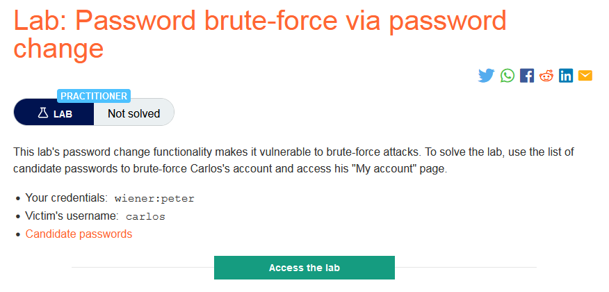
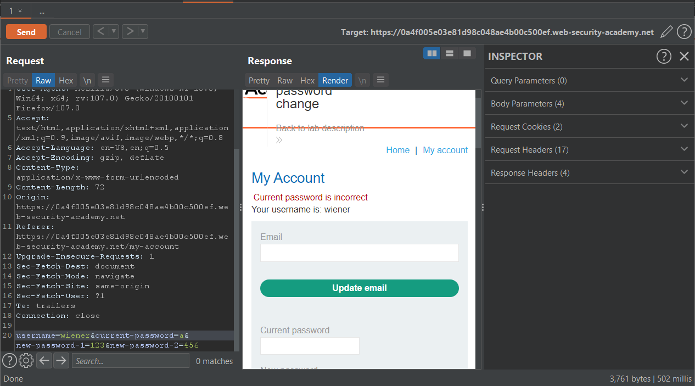
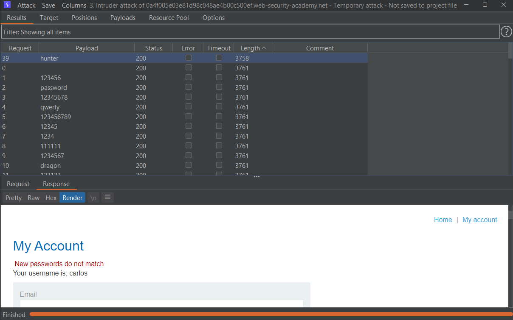
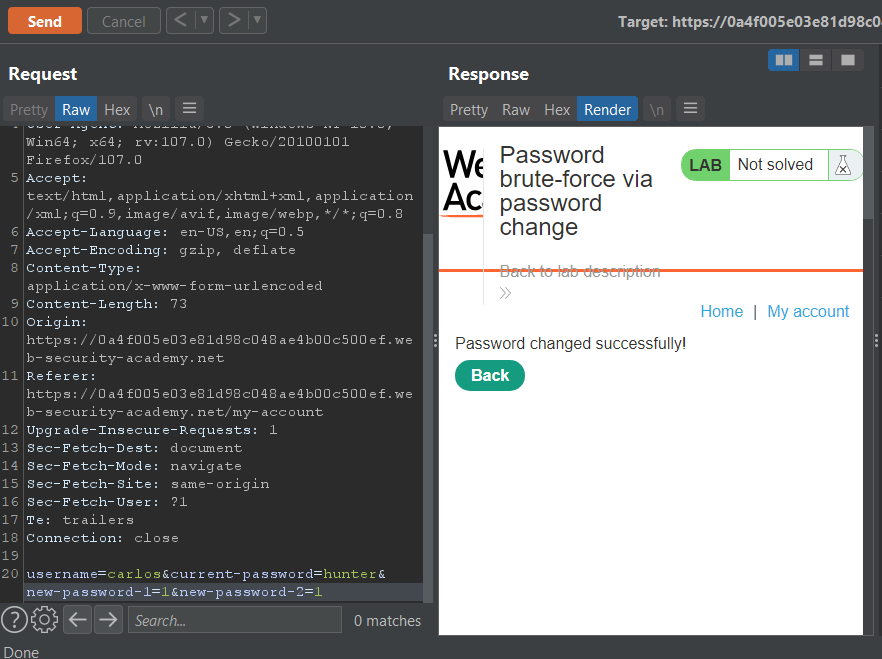
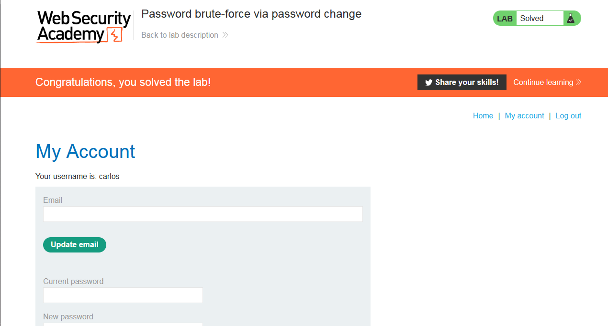

### Giải quyết
- Mô tả cho biết chức năng thay đổi mật khẩu của phòng thí nghiệm dễ bị tấn công brute-force. Vì vậy sau nhiều lần thử chức năng này bằng tài khoản wiener được cung cấp => Khi `current password` sai, hệ thống sẽ vô hiệu hóa session hiện tại và chuyển hướng tới trang login.
- Nếu `current password` sai và `Confirm new password` khác `New password` sẽ hiển thị `Current password is incorrect`.

Nếu `current password` đúng và `Confirm new password` khác `New password` sẽ hiển thị `New passwords do not match`.

- Dựa vào đó có thể thay đổi giá trị `username` thành carlos và sử dụng từ điển password được cung cấp để brute-force password tài khoản carlos.
.
- Chuyển request tới Burp repeater để thay đổi mật khẩu.

- Đăng nhập tài khoản carlos với mật khẩu mới.

###### Solved!

