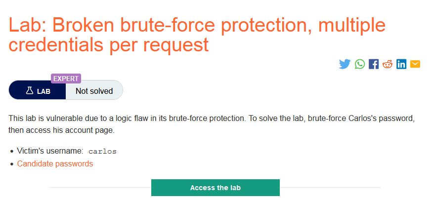
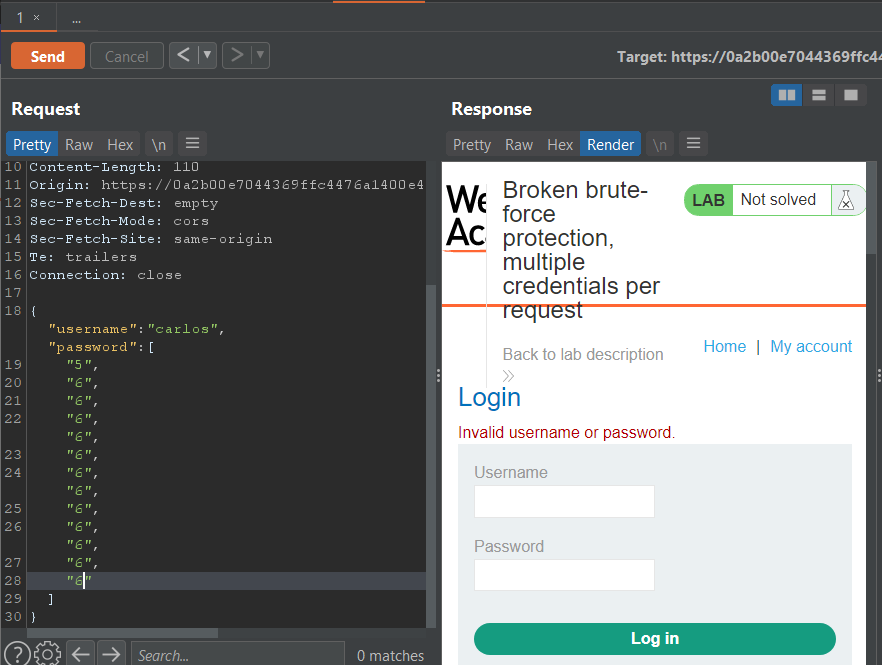
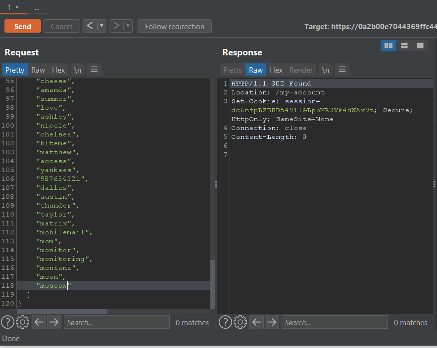
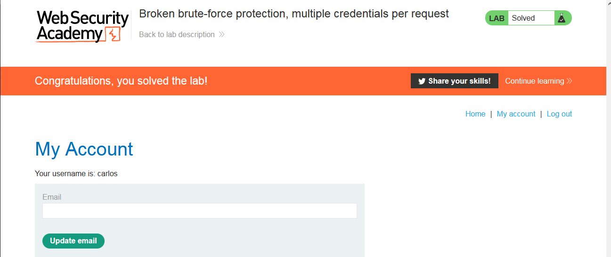

### Giải quyết
- Chức năng đăng nhập của trang web đã được chống brute-force, khi đăng nhập sai nhiều lần, nó sẽ chặn đăng nhập trong 1 phút `
You have made too many incorrect login attempts. Please try again in 1 minute(s). `
- Tuy nhiên trang web gửi thông tin đăng nhập bằng định dạng JSON. Vì vậy sau khi thử thêm khoảng 10 giá trị vào mảng giá trị password thì không bị trang web chặn đăng nhập.

=> Thay mảng giá trị password bằng list giá trị password được cung cấp.

- 302-response đăng nhập thành công follow redirection để chuyển tiếp đến trang tiếp theo.

###### Solved!