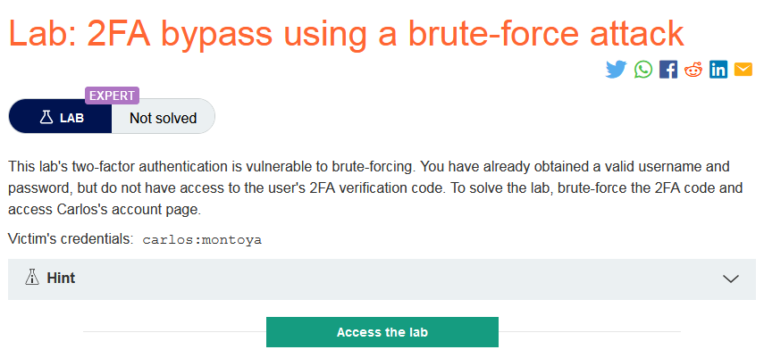
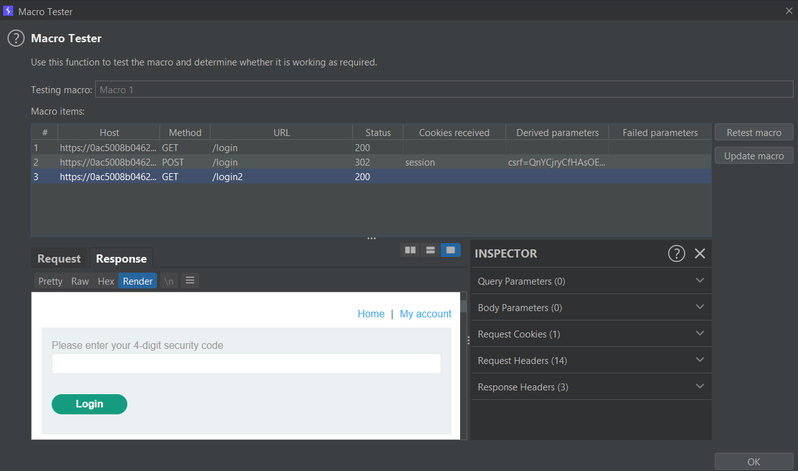
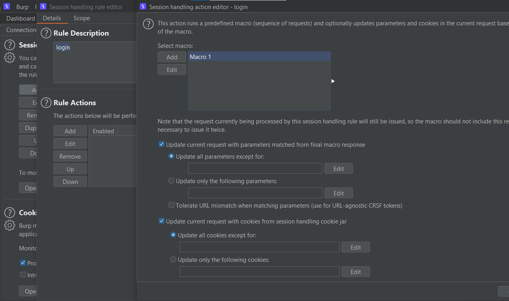
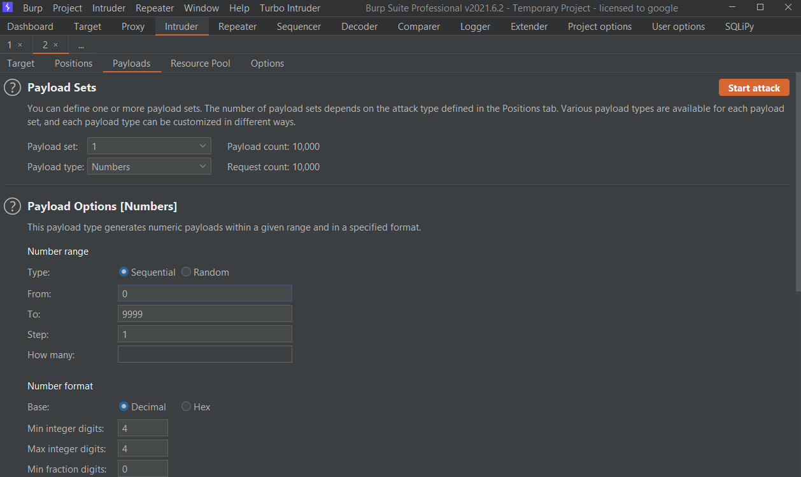
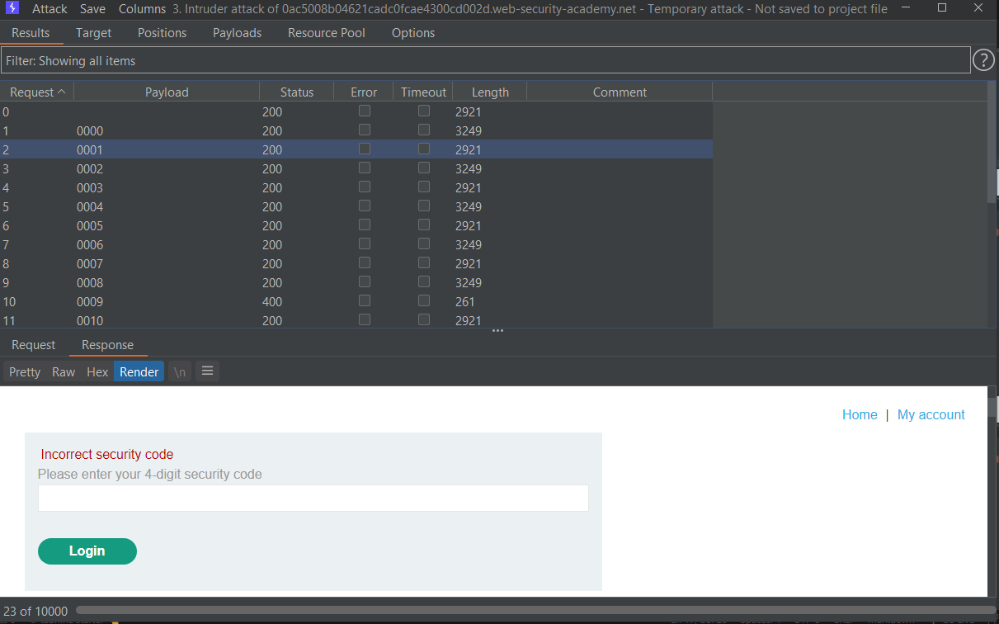
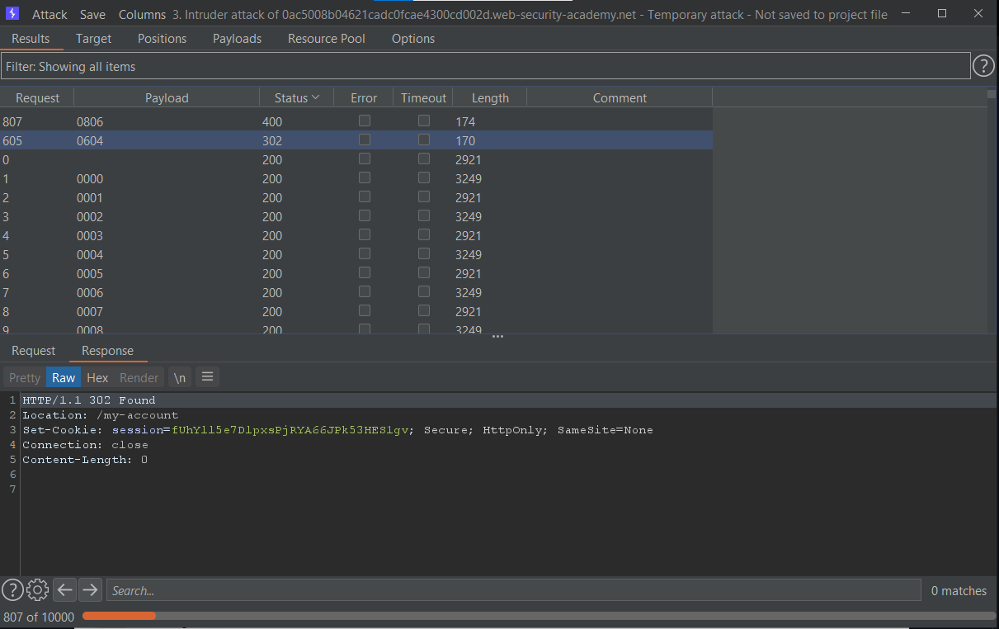
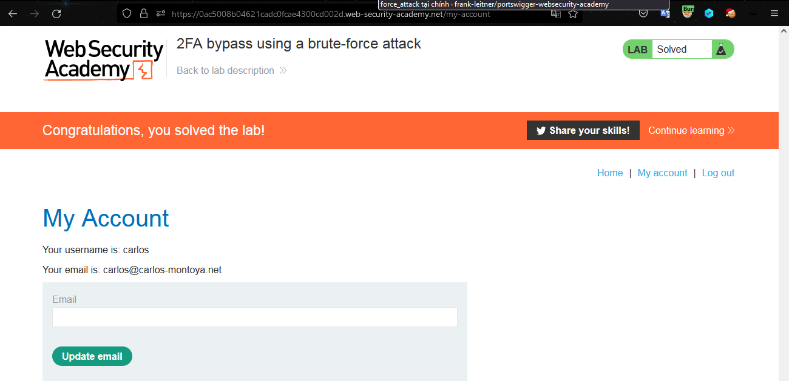

### Giải quyết
- Quy trình đăng nhập:
    - Sau khi đăng nhập với đúng username và password ở trang `/login` người dùng sẽ được chuyển đến trang `/login2`. Tại đây người dùng cần nhập `security code` có 4 chữ số. Nếu nhập sai 2 lần có vẻ session sẽ bị vô hiệu hóa và tài khoản bị đăng xuất người dùng sẽ trở về trang đăng nhập đầu tiên. 
    - Tuy nhiên tài khoản không bị khóa và có thể đăng nhập lại liên tục.
    - Nếu như `security code` không bị thay đổi sau mỗi lần đăng nhập, nó sẽ bị brute-force.
    - Quá trình đăng nhập gồm nhiều request mà Burp intruder đơn giản không thể làm được điều đó.
    - Vì vậy cần sử dụng macro để làm điều đó
- Quy trình brute-force:
    - Add các request và test macro
    
    - Thiết lập `session handling rules`
    
    - Thiết lập intruder với max concurrent requests = 1
    
    - Bắt đầu brute-force security code.
    
    - Sau khi đợi khá lâu thì có vẻ đã tìm ra được security code khi thấy 302-response.
    
    - Show response in browser
    
###### Solved!    

 