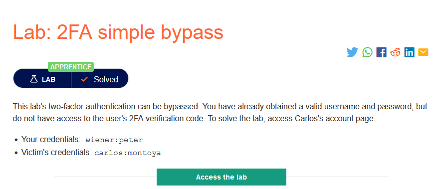
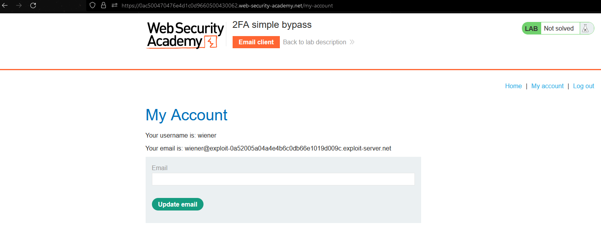
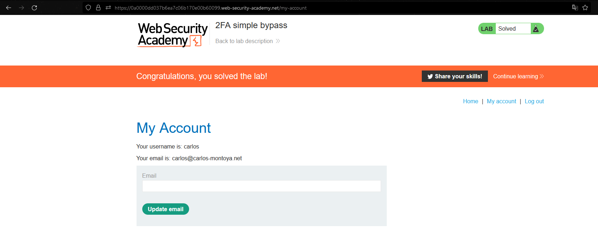

### Mô tả
> Xác thực hai yếu tố của phòng thí nghiệm này có thể bị bỏ qua. Bạn đã có được tên người dùng và mật khẩu hợp lệ, nhưng không có quyền truy cập vào mã xác minh 2FA của người dùng. Để giải quyết phòng thí nghiệm, hãy truy cập trang tài khoản của Carlos.
>
    > Thông tin đăng nhập của bạn: wiener:peter
    > Thông tin xác thực của nạn nhân carlos:montoya
### Giải quyết
` To solve the lab, access Carlos's account page `
- Đầu tiên tiến hành đăng nhập với tài khoản `wiener:peter`
- Sau khi đăng nhập thành công trang web được chuyển tới trang xác thực bằng cách nhập mã được gửi về email của chủ tài khoản. Nếu nhập đúng trang web sẽ chuyển hướng tới trang tiếp theo là `my-account`
- Nếu sai tài khoản sẽ bị đăng xuất

- Logic các bước đăng nhập đúng sẽ là `login -> xác thực -> my-account`
- Theo như mô tả, xác thực 2 yếu tố của trang web có thể bị bỏ qua nên có thể truy cập thẳng sang trang `my-account` bằng cách thủ công mà không cần xác thực.
- Logout tài khoản `wiener` và đăng nhập vào tài khoản `carlos:montoya`
- Tại trang xác thực, sửa đường dẫn `/login2  -> /my-account -> Enter`
###### Solved!

