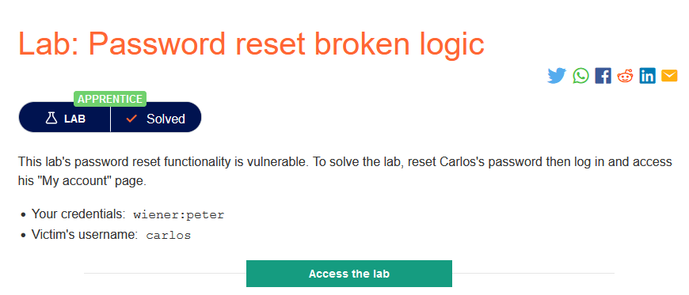
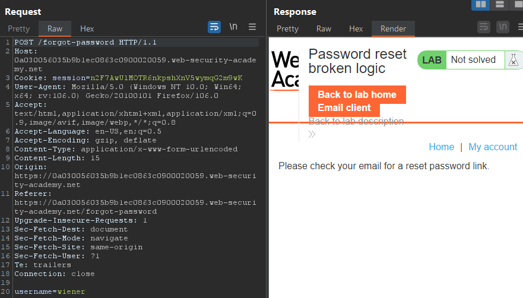
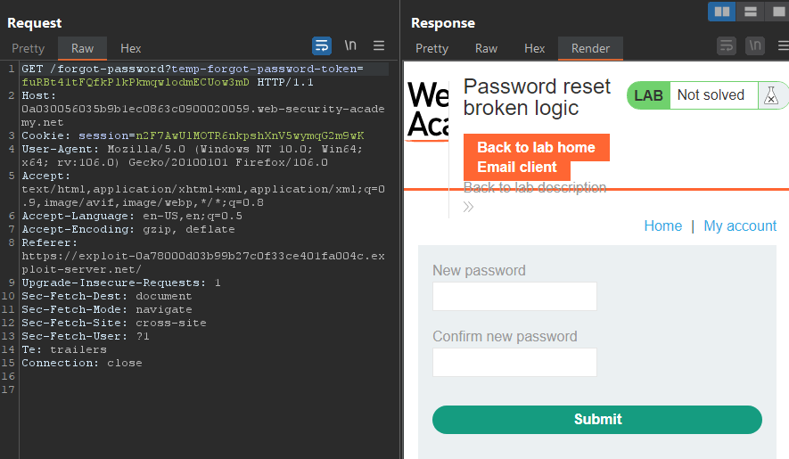
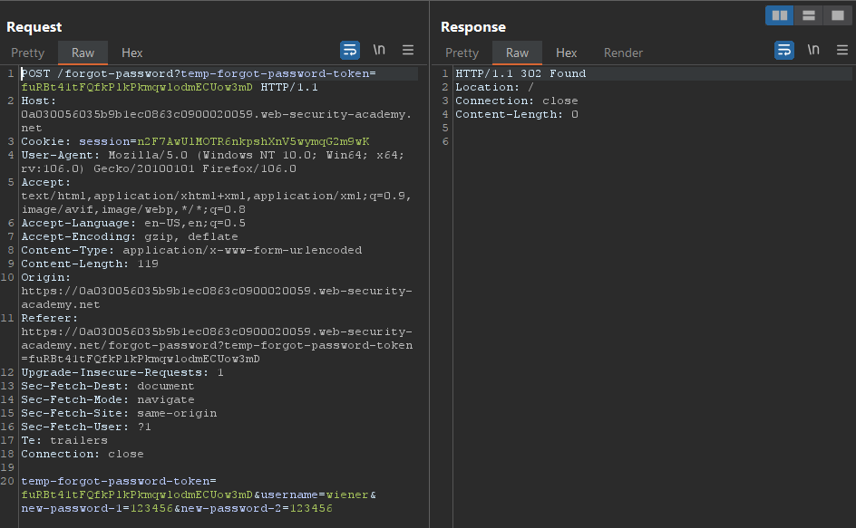
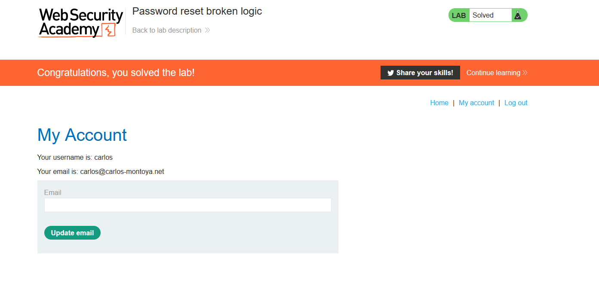

### Mô tả
> Chức năng đặt lại mật khẩu của phòng thí nghiệm này dễ bị tấn công. Để giải quyết phòng thí nghiệm, hãy đặt lại mật khẩu của Carlos, sau đó đăng nhập và truy cập trang "My account" của anh ấy.
    > Thông tin đăng nhập của bạn: wiener:peter
    > Tên người dùng của nạn nhân: carlos
### Giải quyết 
- ` To solve the lab, reset Carlos's password then log in and access his "My account" page. `
- Thử chức năng reset password với tài khoản `wiener` và xem các request khi thực hiện reset password 
- Đầu tiên, nhập tài khoản cần reset và 1 đường link để truy cập trang reset password sẽ được gửi về email

- Truy cập đường link đến trang reset password 

- Nhập password mới của `wiener` là `123456` và request gửi đi sẽ có 1 token, username, new password, confirm password

- Mà chức năng reset password này dễ bị tấn công, vì vậy có thể token đi kèm không có tác dụng gì -> đổi username `wiener` -> `carlos` với mật khẩu là `123456` -> send request
- Quay lại trang đăng nhập vào tài khoản `carlos` với mật khẩu mới.

###### Solved!
