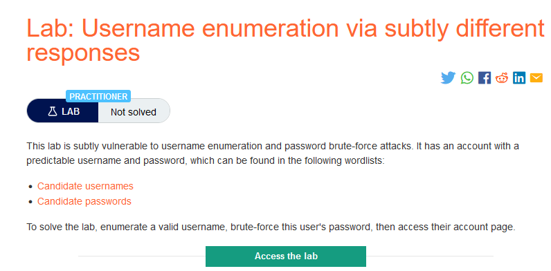
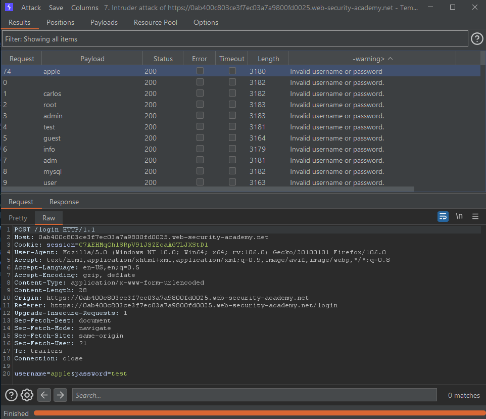
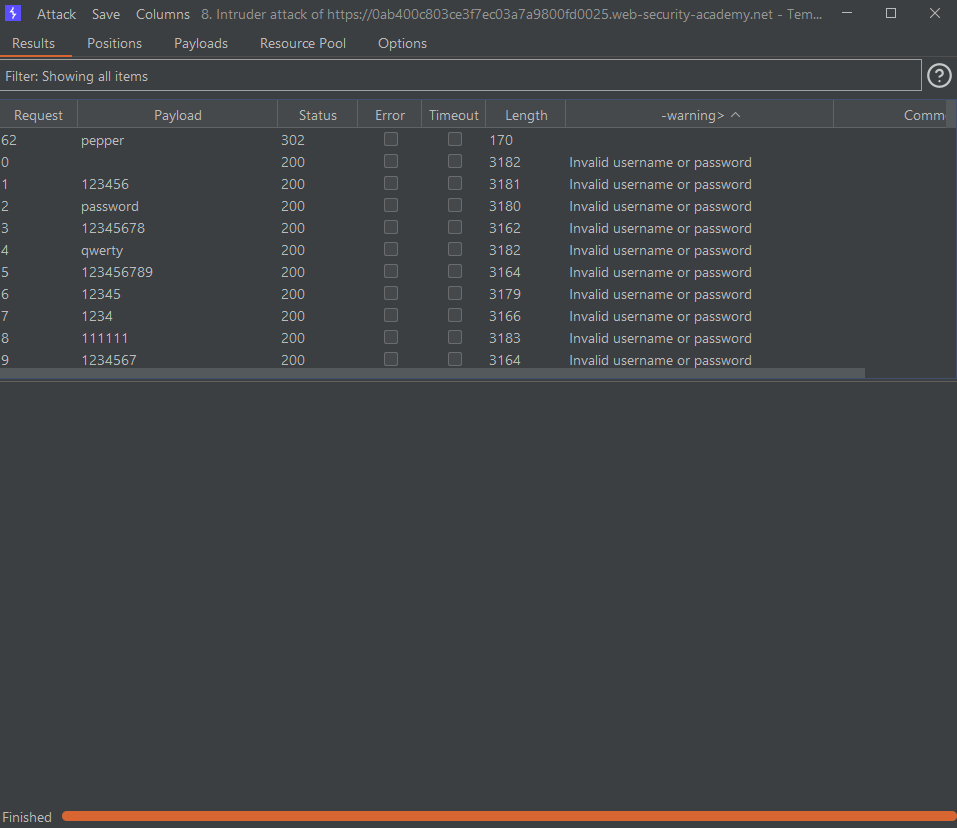
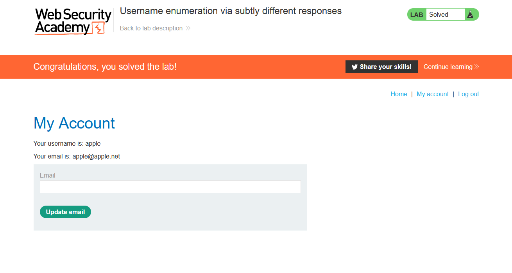

### Mô tả
> Phòng thí nghiệm này rất dễ bị tấn công bởi các cuộc tấn công brute-force tên người dùng và mật khẩu. Nó có một tài khoản với tên người dùng và mật khẩu có thể dự đoán được, có thể tìm thấy trong danh sách từ sau:
>
>    [Candidate usernames](https://portswigger.net/web-security/authentication/auth-lab-usernames)
>    [Candidate passwords](https://portswigger.net/web-security/authentication/auth-lab-passwords)
>
> Để giải phòng thí nghiệm, hãy liệt kê một tên người dùng hợp lệ, brute-force mật khẩu của người dùng này, sau đó truy cập trang tài khoản của họ. 
### Giải quyết
`To solve the lab, enumerate a valid username, brute-force this user's password, then access their account page. ` 
- Ở lab này sẽ có 2 phản hổi, 1 khi nhập sai username, 2 khi nhập đúng username và sai password
- Vậy nên có thể brute-force nhanh bằng cách brute-force username trước để lấy username đúng và sau đó brute-force password với username đã lấy được. Từ đó số request cũng sẽ giảm đi rất nhiều.
- Bắt request login -> send to intruder -> Attack type: Sniper -> set payload vào giá trị của username -> tab Payloads -> paste danh sách username với simple list -> tab Options -> Grep - Extract: Add -> Refetch response -> Bôi đen `Invalid username or password.` -> OK -> Start attack
- Ở cột cuối cùng response extract không có dầu `.` giống những response khác -> username: `apple`
  
- Quay lại intruder điền username vừa tìm được -> add payload vào giá trị của password -> paste danh sách password với simple list -> Start attack.
- Kết quả trả về có 1 giá trị không khớp ở cột cuối cùng -> password đúng

- Đăng nhập với username và password tìm được.

###### Solved!