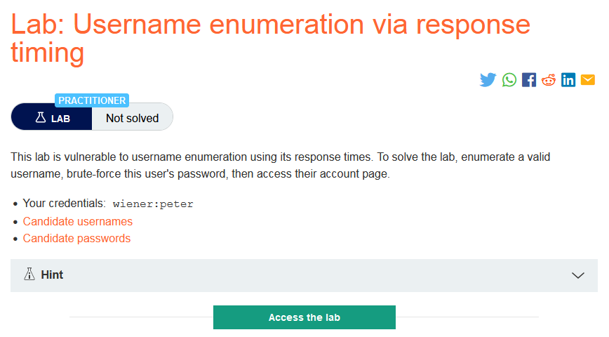
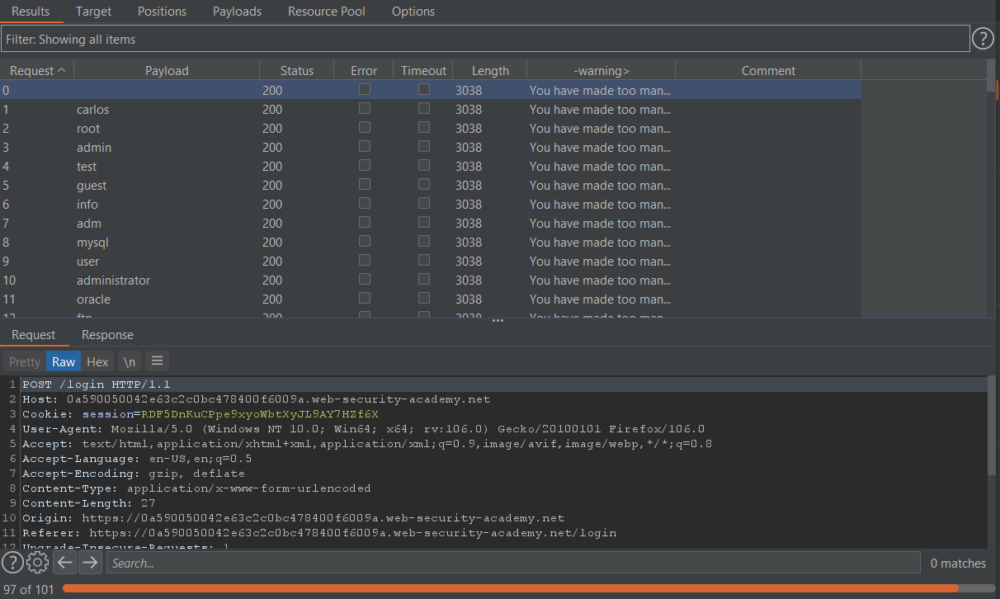
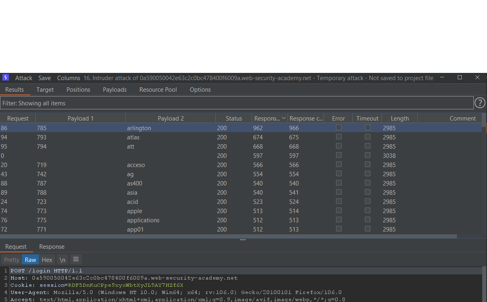
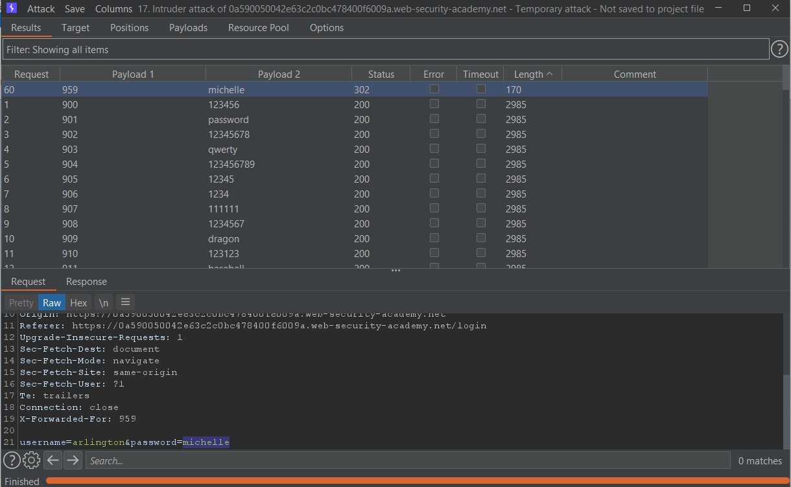
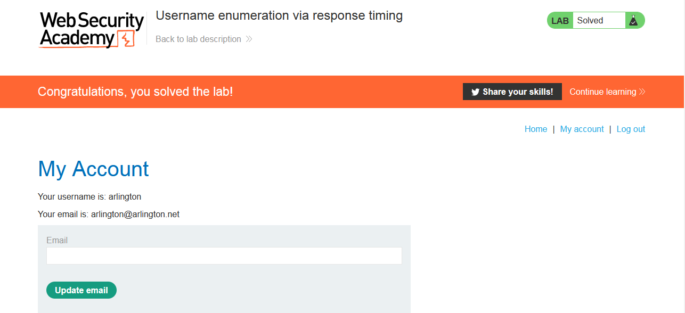

### Mô tả 
> Phòng thí nghiệm này dễ bị liệt kê tên người dùng bằng cách sử dụng thời gian phản hồi của nó. Để giải phòng thí nghiệm, hãy liệt kê một tên người dùng hợp lệ, brute-force mật khẩu của người dùng này, sau đó truy cập trang tài khoản của họ.
>
> Thông tin đăng nhập của bạn: wiener: peter
>
>> [Candidate usernames](https://portswigger.net/web-security/authentication/auth-lab-usernames)
[Candidate passwords](https://portswigger.net/web-security/authentication/auth-lab-passwords)
### Giải quyết
- Đầu tiên nếu brute-force theo cách thông thường giá trị của biến username và grep - extract cụm `Invalid username or password.` , kết quả là IP bị block vì gửi quá nhiều request 

- Sử dụng X-Forwarded-For giả mạo ip để vượt qua bức tường đầu tiên
- Thêm X-Forwarded-For header và brute-force giá trị là 1 số bất kỳ (sử dụng payload đơn giản là các số tăng dần) với số lượng >= số request, đồng thời brute-force giá trị username. Attack type: Pitchfork  
- Mô tả lab cho biết có thể xác định username đúng bằng cách sử dụng thời gian trả về. Hiển thị thời gian trả về bằng cách chọn Columns -> tích chọn Response received và Response completed. Nếu request có username nhập vào đúng sẽ có Response received lâu hơn đáng kể so với những request có username sai.
- Để chắc chắn về điều này nên lặp lại cuộc tấn công brute-force 1 vài lần
`-> username: arlington`

- Tiếp theo sử dụng username vừa tìm được sau đó brute-force password và ip 
 
- Đăng nhập với username và password đúng 
 
###### Solved!