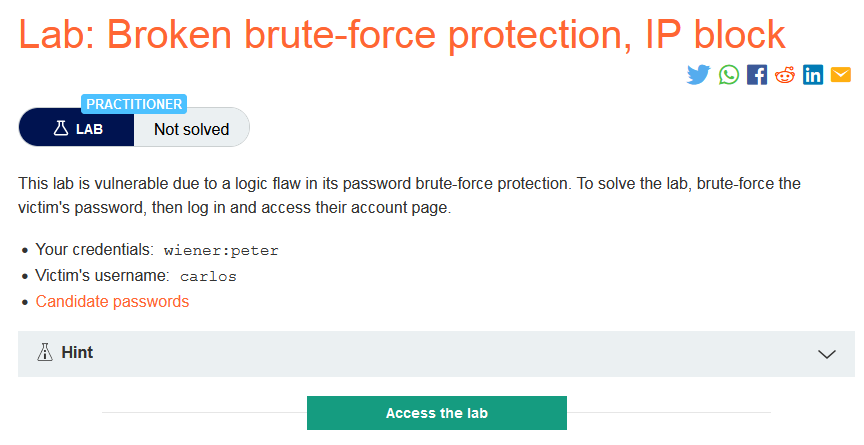
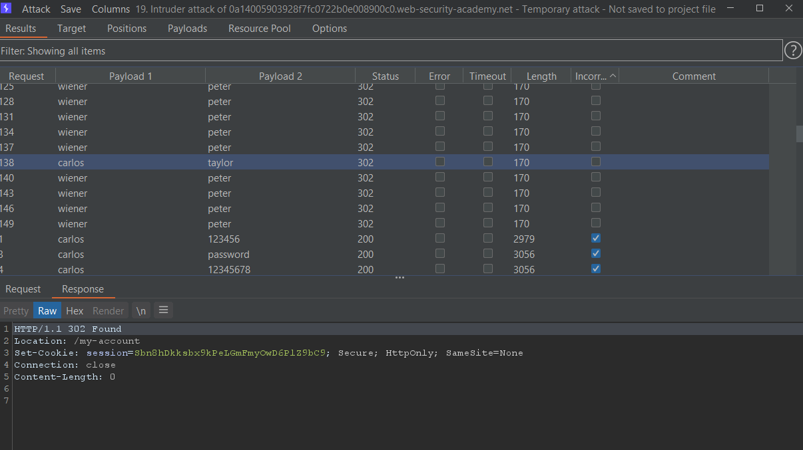
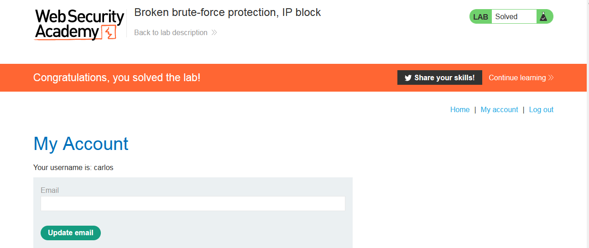

### Mô tả
> Phòng thí nghiệm này dễ bị tấn công do một lỗ hổng logic trong bảo vệ chống brute-force mật khẩu. Để giải bài lab, hãy brute-force mật khẩu của nạn nhân, sau đó đăng nhập và truy cập trang tài khoản của họ.
>
>>    Your credentials: wiener:peter
>    Victim's username: carlos
>    [Candidate passwords](https://portswigger.net/web-security/authentication/auth-lab-passwords)
### Giải quyết
- Tại lab này không thể giả mạo ip bằng X-Forwarded-For header để bypass IP block.
- Cứ mỗi 3 lần đăng nhập sai sẽ phải đợi 1 phút để có thể đăng nhập lại. Vì vậy có thể brute-force bằng cách xen giữa 2 lần đăng nhập sai là 1 lần đăng nhập đúng bằng tài khoản `wiener` 
- Sử dụng `Attack type: Pitchfork`, chỉnh sửa Resource pool với max request là 1 để request được gửi đi lần lượt và chỉnh sửa lại danh sách username, password phù hợp với phương pháp tấn công 
- Lọc các request để lấy username và password 

`username: carlos`
`password: taylor`

###### Solved!