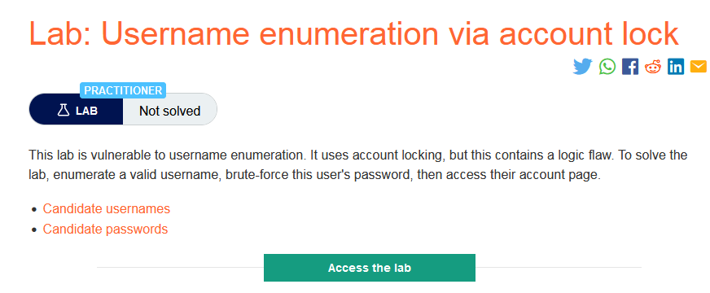
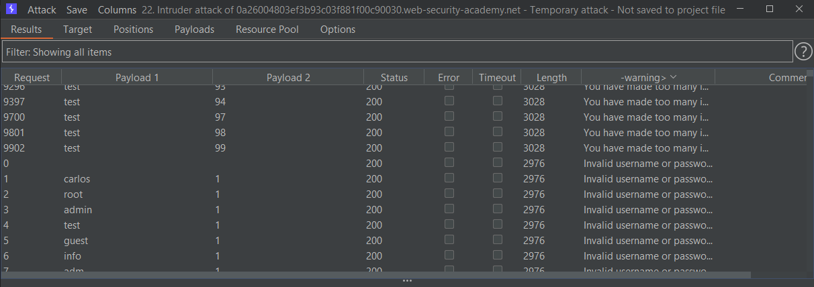
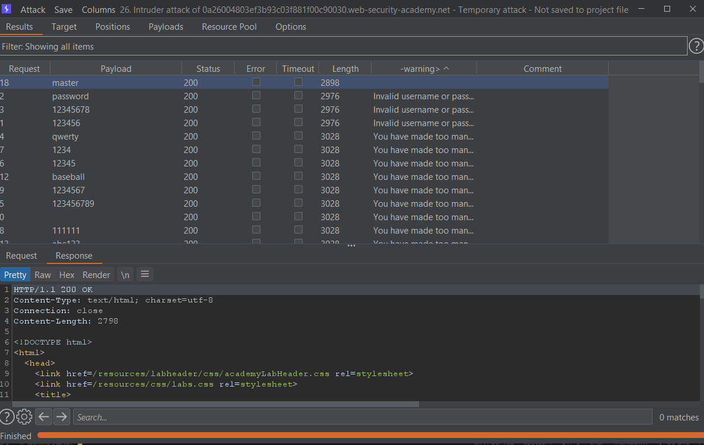
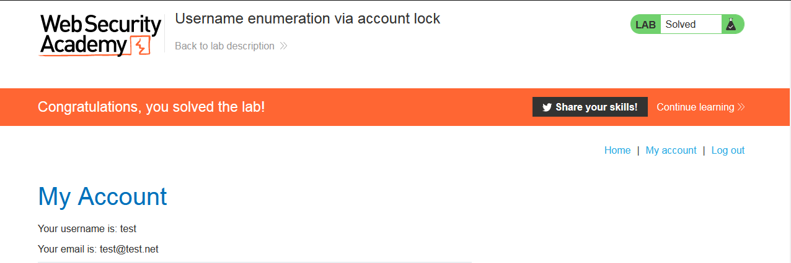

### Mô tả 
> Phòng thí nghiệm này dễ bị liệt kê tên người dùng. Nó sử dụng khóa tài khoản, nhưng điều này chứa một lỗ hổng logic. Để giải phòng thí nghiệm, hãy liệt kê một tên người dùng hợp lệ, brute-ép mật khẩu của người dùng này, sau đó truy cập trang tài khoản của họ.
>> [Candidate usernames](https://portswigger.net/web-security/authentication/auth-lab-usernames)
[Candidate passwords](https://portswigger.net/web-security/authentication/auth-lab-passwords)
### Giải quyết
- Theo như mô tả và sau khi thử, nếu username chính xác mà sai password quá 3 lần, response trả về `You have made too many incorrect login attempts. Please try again in 1 minute(s).`.
- Từ đó có thể tìm ra `username: test`

- Add payload và brute-force giá trị password với username test `-> password: master`

###### Solved!

