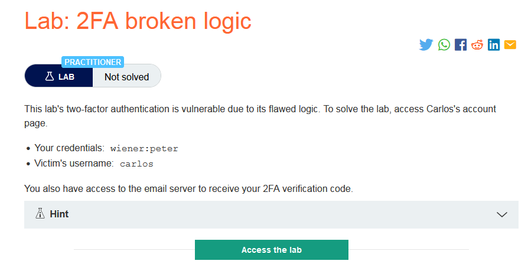
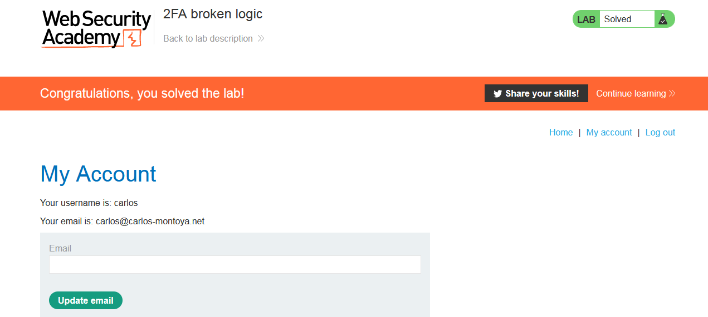

### Mô tả 
>  Xác thực hai yếu tố của phòng thí nghiệm này dễ bị tổn thương do logic thiếu sót. Để giải quyết phòng thí nghiệm, hãy truy cập trang tài khoản của Carlos.
>>  Your credentials: wiener:peter
    Victim's username: carlos
>
> Bạn cũng có quyền truy cập vào máy chủ email để nhận mã xác minh 2FA của mình. 
### Giải quyết
- Đầu tiên đăng nhập và xác thực 2 yếu tố như bình thường với tài khoản `wiener` để burp có thể bắt được hết request trong quá trình đăng nhập.
- Ở request tới `my-account` khi thay đổi giá trị biến verify thành carlos thì response trả về vẫn là account của wiener  
- Thử thay đổi giá trị biến verify thành carlos -> send request và kiểm tra email wiener -> không có code mới -> code được gửi đến mail carlos
- `Send POST request gửi code sang Intruder -> thay đổi giá trị biến verify thành carlos -> add payload giá trị biến code -> brute-force 4 ký tự chỉ toàn số -> response 302 -> lấy code -> post code`

###### Solved!