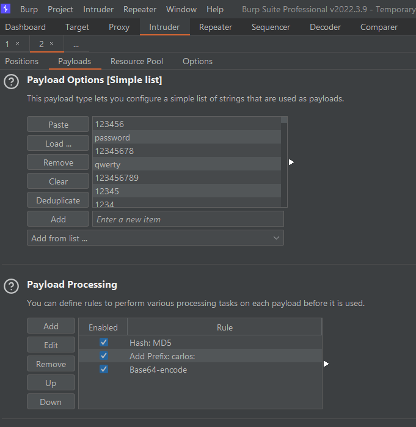
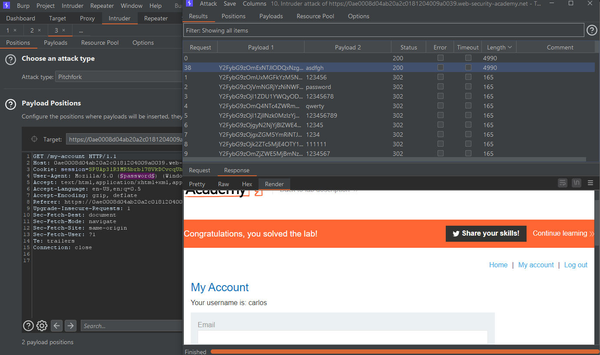

### Mô tả
> Phòng thí nghiệm này cho phép người dùng tiếp tục đăng nhập ngay cả sau khi họ đóng phiên trình duyệt của mình. Cookie được sử dụng để cung cấp chức năng này dễ bị brute-force.
>
> Để giải quyết phòng thí nghiệm, hãy brute-force cookie của Carlos để có quyền truy cập vào trang "My account" của anh ấy.
>>  Your credentials: wiener:peter
>>  Victim's username: carlos
> [Candidate passwords](https://portswigger.net/web-security/authentication/auth-lab-passwords)
### Giải quyết
##### Phân tích
- Đầu tiên đăng nhập vào tài khoản `wiener` như thường lệ, và quan sát những request trong tab `Target`. Khi đăng nhập tích chọn `Stay logged in`.
- Quan sát thấy response trả về khi đăng nhập và trong header của request đến "My account" có cùng 1 giá trị cookie `stay-logged-in=d2llbmVyOjUxZGMzMGRkYzQ3M2Q0M2E2MDExZTllYmJhNmNhNzcw`
- `Send request đến "My account" sang Repeater -> bôi đen phần giá trị cookie `
- Tại tab Inspector bên phải, giá trị cookie được decode ra: `wiener:51dc30ddc473d43a6011e9ebba6ca770`. Giá trị đằng sau username có thể là password bị hash và từ độ dài của chuỗi hash -> MD5
- Thử đem chuỗi hash đi search -> peter -> password

- Từ đó có thể suy ra phương pháp brute-force cookie: `hash md5 password -> thêm "username:" vào trước chuỗi hash -> base64 encoded chuỗi giá trị -> stay-logged-in cookie`
- Sử dụng Payload Processing để thực hiện chuỗi thao tác.

- Đăng xuất tài khoản wiener và thực hiện tấn công 

- Để biết password -> thêm payload vào phần User-agent sử dụng cùng 1 wordlist với cookie 

###### Solved!
