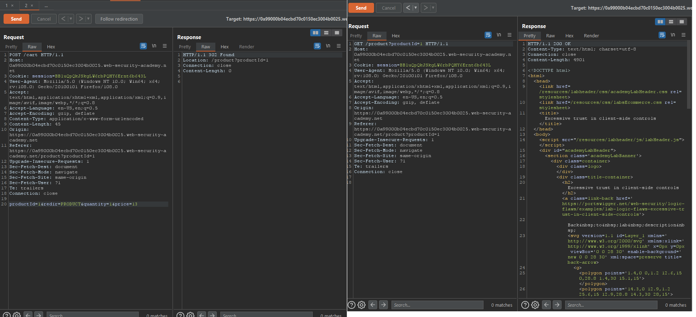

### Giải quyết
- Sau khi đăng nhập trang web mua hàng bằng tài khoản `wiener` được cung cấp, nhận thấy rằng tài khoản được cấp sẵn `100$` để mua sắm. Nhưng phòng thí nghiệm yêu cầu mua sản phẩm `Lightweight l33t leather jacket` có giá `1337$`.
- Tiến hành thêm sản phẩm vào giỏ hàng và mua như bình thường, tất nhiên sẽ không thể order vì số tiền trong tài khoản không đủ.
- Quay lại Burpsuite và xem xét những request => khi thêm sản phẩm vào giỏ hàng, request được gửi đi bao gồm cả giá của sản phầm đó. Vì vậy chuyển request đó sang Repeater và sửa lại giá sản phẩm.

- Request được gửi đi thành công, quay lại giỏ hàng kiểm tra và giá sản phẩm đã bị thay đổi. Sau đó đặt hàng bình thường.

###### Solved!

