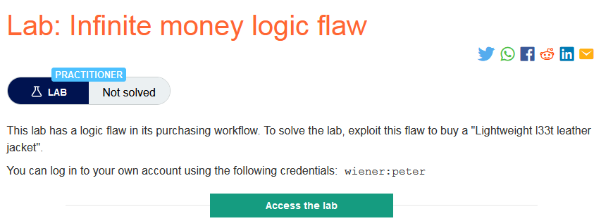

### Giải quyết
- Phân tích trang mua hàng:
    - Khác với trang mua hàng ở những lab trước, ở đây có thêm chức năng sử dụng gift card và gift card đó phải mua với giá 10$.
    - Sau khi sử dụng gift card người dùng sẽ được hoàn lại 10$ = với giá tiền của gift card, vậy thì có tác dụng gì?
    - Tuy nhiên mỗi lần mua gift card người dùng có thể sử dụng mã giảm giá 30% `SIGNUP30` lấy được khi `Sign up to our newsletter!` tại trang chủ.
    
    - Và số lần thực hiện hành động này là không giới hạn, vì thế sau mỗi lần người dùng sẽ lãi được 3$.
    
    - Đó chính là phần cần được khai thác để có thể hoàn thành  phòng thí nghiệm này 
- Sử dụng macro với null payload để lặp lại thao tác khi mua và sử dụng gift card
- Add code sau khi thanh toán gift card cho request tiếp theo

- Sau khi test thành công tạo `rule` và tiến hành attack bằng burp intruder lặp lại 1 request nào đó với null payload

- Vì thực hiện nhiều request lần lượt nên thời gian hoàn thành khá lâu, khoảng hơn 400 payload 

###### Solved!
