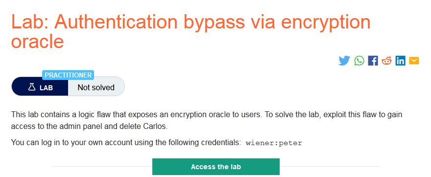
### Giải quyết
- Phân tích các chức năng:
    - Đăng nhập: Tại trang đăng nhập có tính năng `stay-logged-in`, và hệ thống sẽ xác nhận tính năng ghi nhớ đăng nhập của người dùng thông qua cookie `stay-logged-in`
    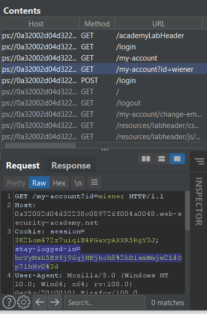. Tuy nhiên khó có thể đoán được dạng encode của cookie.
    - Chức năng comment: Trường `gmail` không có thuộc tính type nên có thể nhập sai định dạng. Sau khi post comment, sẽ được chuyển tiếp kèm cookie `notification` và response trả về chứa 1 thông báo lỗi `Invalid email address: aaa `
    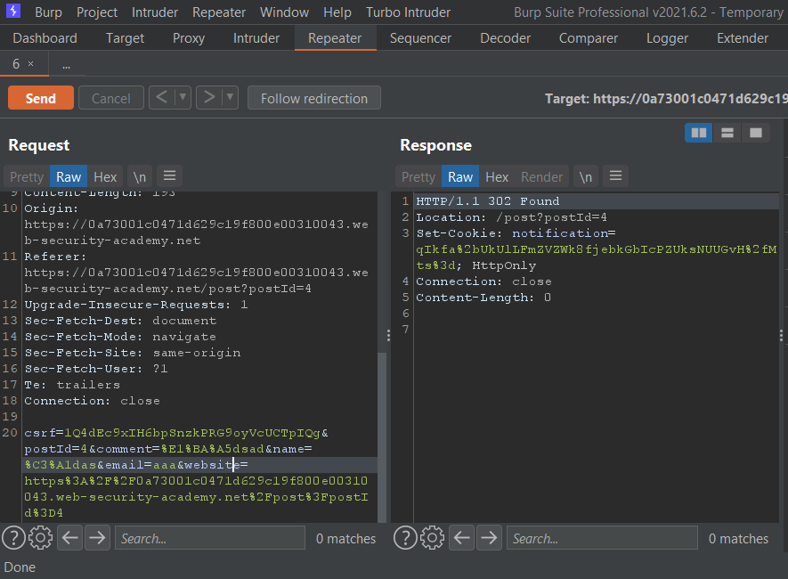
    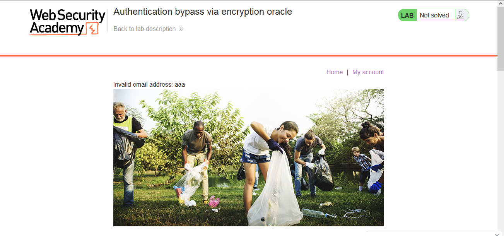
    - Khi thử bỏ cookie `notification` thì trong response trả về phần thông báo lỗi gmail cũng biến mất.
    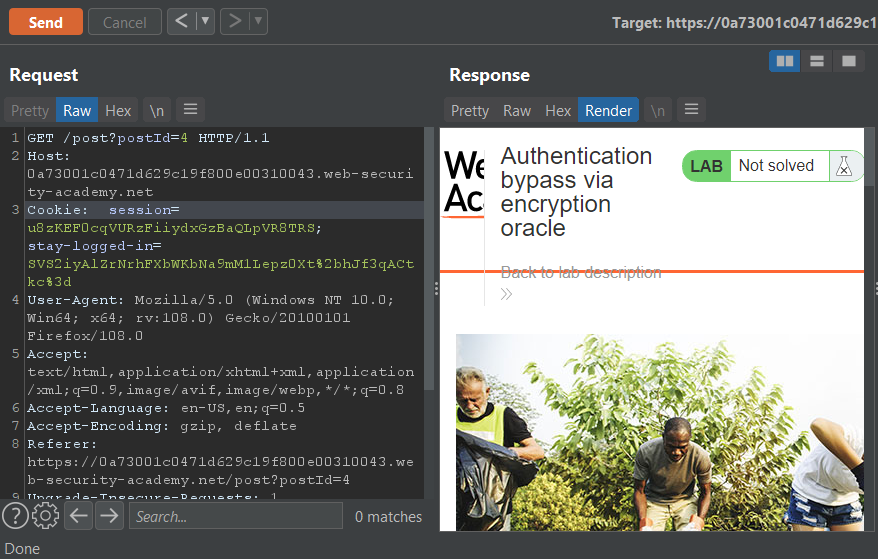
    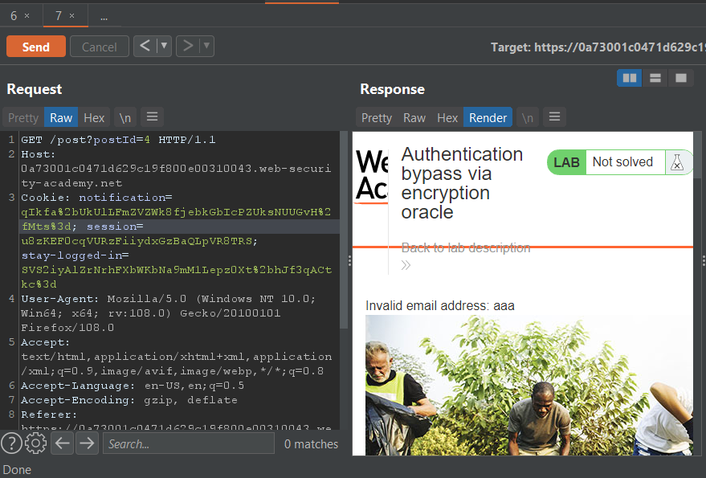
    `=> dòng thông báo lỗi trong response được quy định xuất hiện dựa vào cookie "notification", hay giá trị cookie "notification" chính là mã hóa của dòng thông báo "Invalid email address: aaa" và dòng thông báo trả về cho người dùng chính là giá trị sau khi giải mã cho cookie "notification"`
    - Dự đoán trang web sử dụng cùng một kiểu mã hóa trong các cookie `stay-logged-in` và `notification`. Để kiểm tra chúng ta có thể thay giá trị cookie `notification` bằng giá trị `stay-logged-in`
    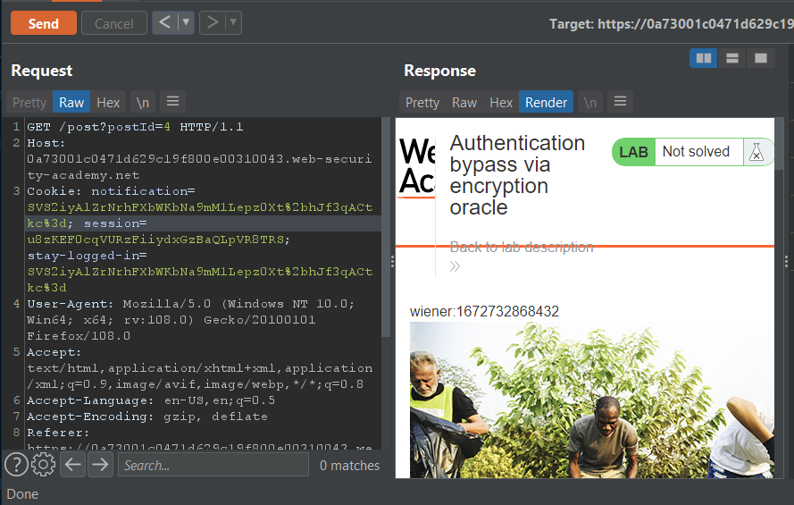
- Sau khi phân tích có thể đưa ra kết luận:
    - Form giá trị cookie `stay-logged-in` trước khi mã hóa có thể là `username:timestamp`
    - Chức năng comment có thể được sử dụng để mã hóa giá trị và chức năng và response trả về được sử dụng để giải mã.
- Tiếp theo cần tìm cách để mã hóa đúng giá trị đã cookie `stay-logged-in` tức là giá trị cookie `notification` sau khi giả mã là `Invalid email address: username:timestamp` và chúng ta cần biến nó về chỉ còn `username:timestamp`
- Đầu tiên thử decode giá trị cookie:
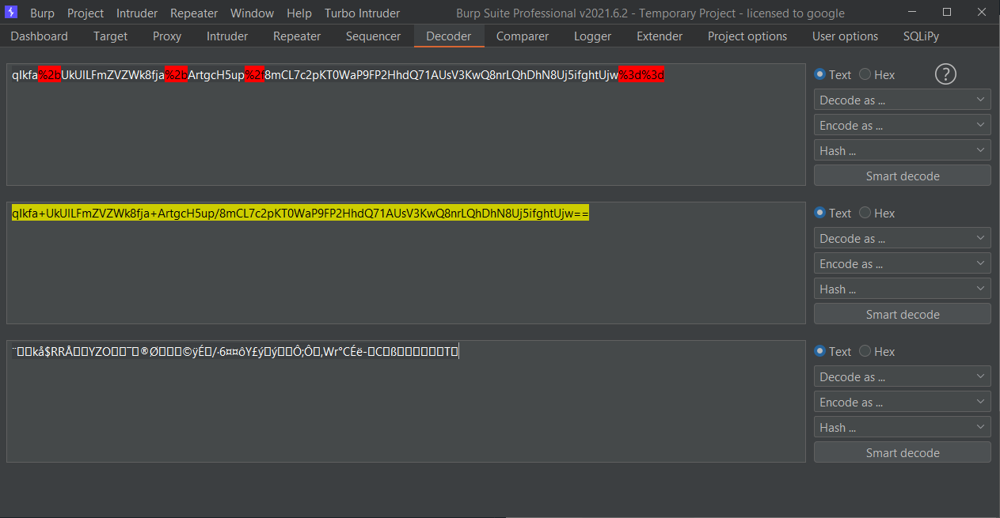. Sau đó thử xóa 1 ký tự đầu tiên và encode base64 => encode url rồi thay vào giá trị cookie `notification` và nhận được thông báo lỗi khi giải mã `Input length must be multiple of 16 when decrypting with padded cipher` 
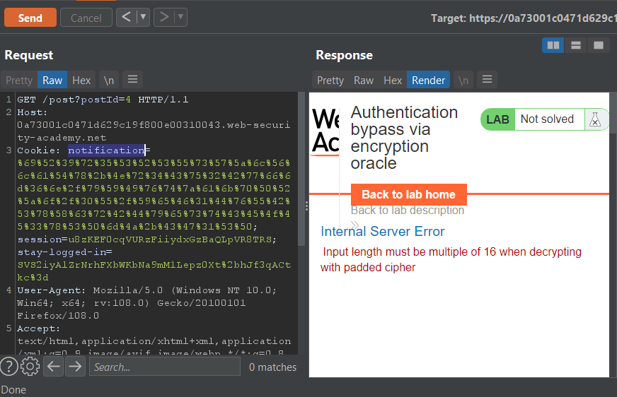
=> độ dài input phải là bội của 16. Mà ban đầu độ dài input khi decode ra là 64, sau đó xóa đi 1 => lỗi => thử xóa đi 16 ký tự và encode lại.
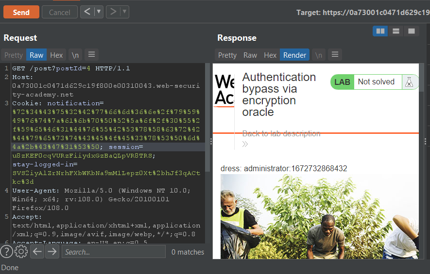
- Số ký tự bị mất sau khi decode đúng bằng số ký tự xóa đi => hiện tại trước `adminstrator` đã có 7 ký tự thêm vào trước `adminstrator` 9 ký tự để xóa đi 32 ký tự giải mã được đúng form cần dùng.
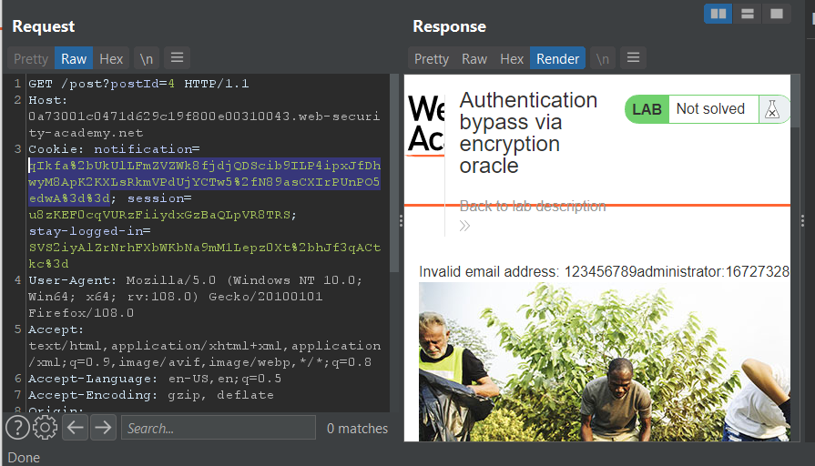
- Decode giá trị cookie mới và xóa 32 ký tự đầu tiên đi ta được đúng form cần dùng.
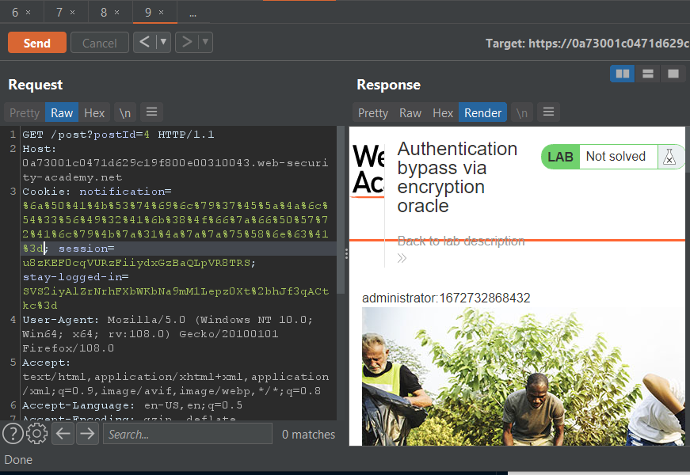
- Thay giá trị này vào cookie `stay-logged-in` và xóa `session` thành công truy cập admin.
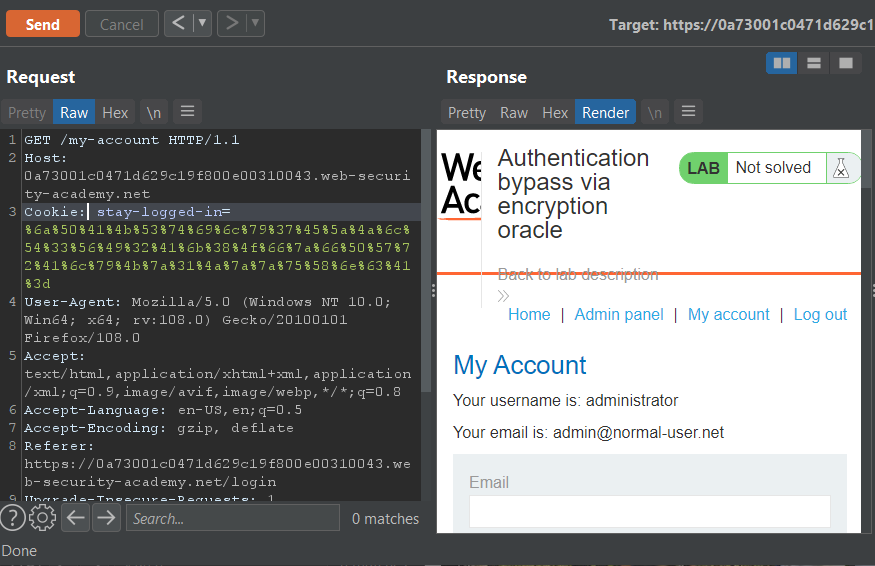
- `Request in browser` và thực hiện nốt các bước còn lại để hoàn thành lab.
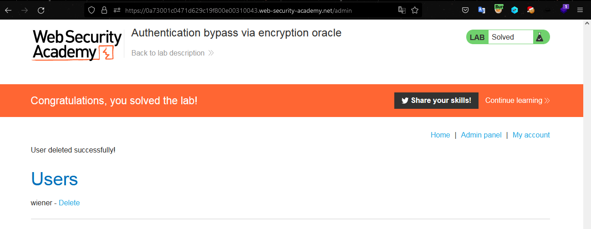
###### Solved!

         