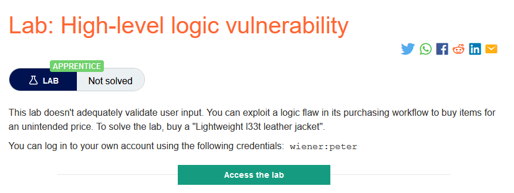
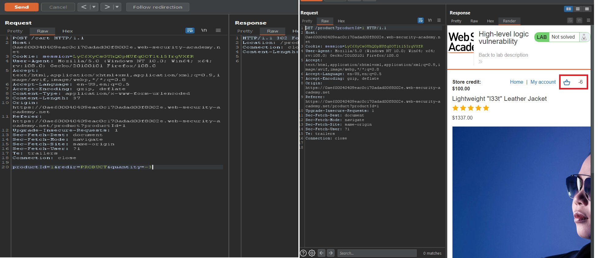
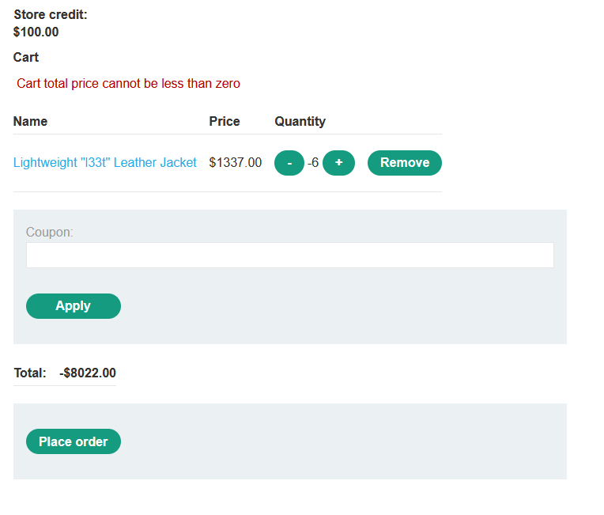
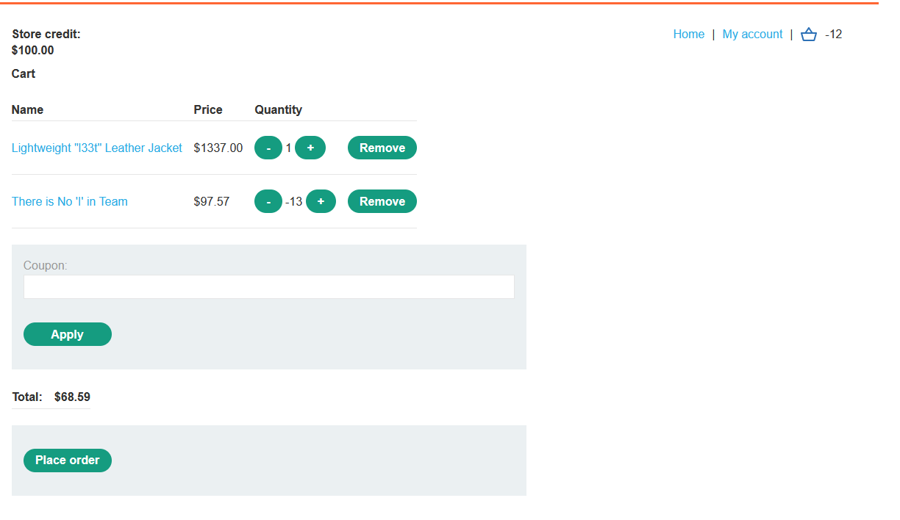
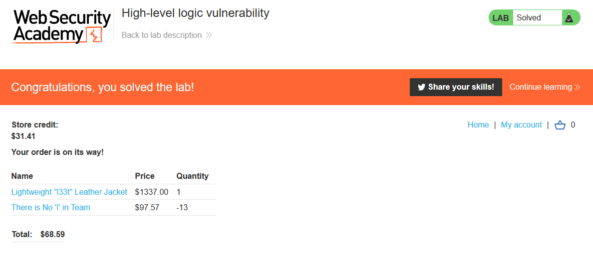

### Giải quyết
- Phòng thí nghiệm này không xác thực đầy đủ đầu vào từ người dùng, vì thế khi thêm sẳn phẩm vào giỏ hàng có thể dễ dàng thay đổi giá trị số lượng sản phẩm `quantity` <0 từ đó giá trị cần thanh toán cùng <0

- Tuy nhiên khi nếu chỉ có sản phẩm có số lượng <0 thì không thể thanh toán vì số tiền phải > 0.

- Thử thêm số lượng 1 sản phẩm cần mua và <0 với những sản phẩm không cần thiết để giá tiền thanh toán trong mức cho phép.

- Tiến hành thanh toán thành công.

###### Solved!
