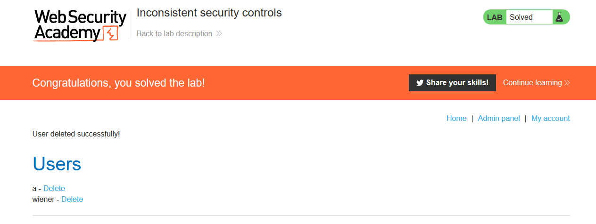

### Giải quyết
- Trang web cho phép người dùng có thể đăng ký 1 tài khoản. Nếu nhân viên làm việc cho `DontWannaCry` và có mail `@dontwannacry.com` thì tài khoản đăng ký có thể truy cập trang admin. Nếu không người dùng vẫn có thể đăng ký bằng email ngoài.
- Và sau khi điền form đăng ký, 1 đường link sẽ được gửi đến mail đã cung cấp.
- Trước hết, đăng ký tài khoản bằng địa chỉ email được cấp trong `email client` => truy cập link đăng ký nhận được trong `email client` và đã thành công đăng ký 1 tài khoản.
- Sau đó, đăng nhập vào tài khoản vừa đăng ký. Bây giờ trong `My account` người dùng có thể thay đổi email đã đăng ký trước đó => thử thay đổi email thành `attacker@dontwannacry.com` 

- Thay đổi thành công, trang web đã không có bất kỳ 1 hành động nào để xác minh quyền sở hữu email như trong lúc đăng ký tài khoản. Việc này giúp cho người dùng bên ngoài dễ dàng sử dụng tất cả chức năng của admin

- Hoàn thành lab.

###### Solved!

