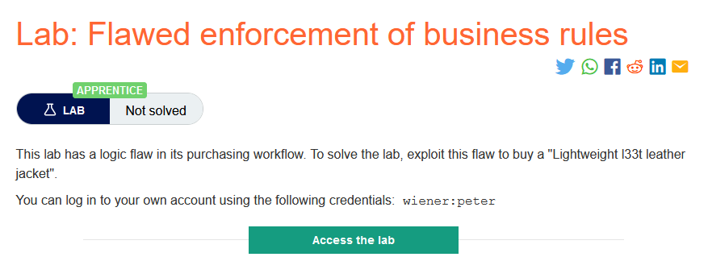
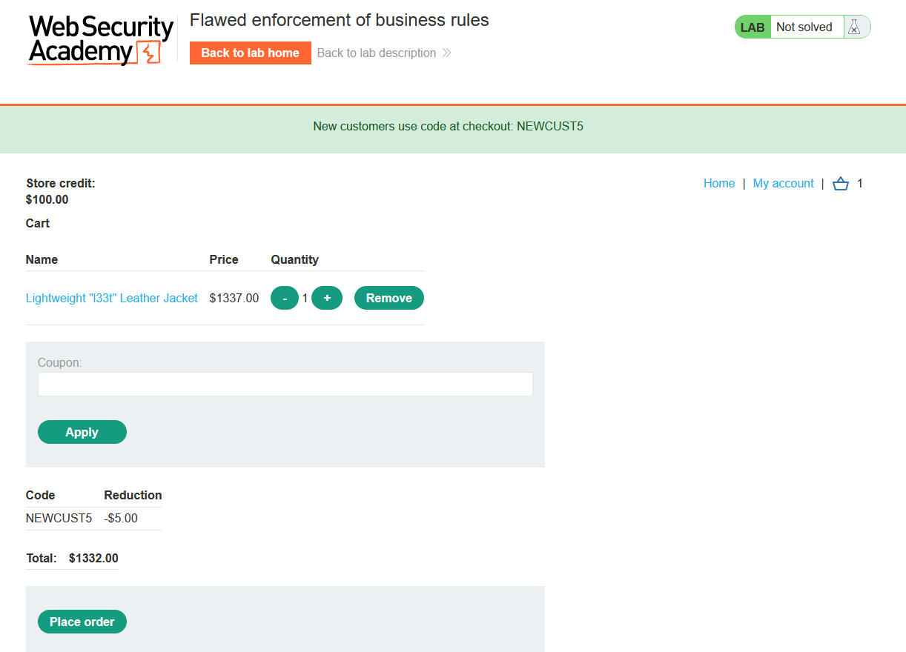
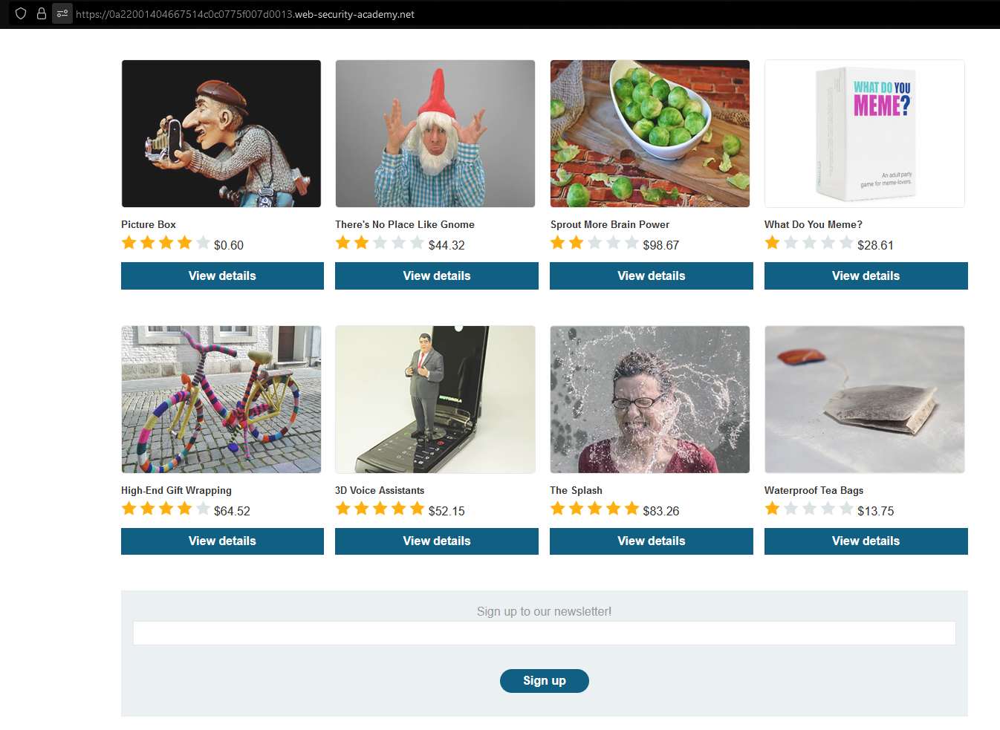
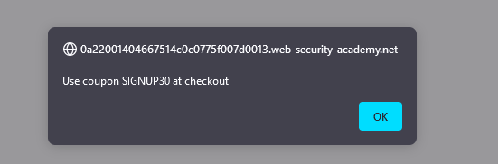
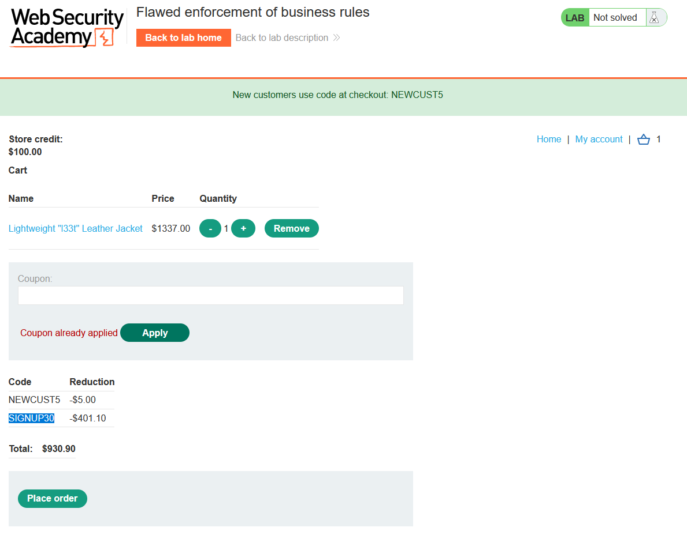
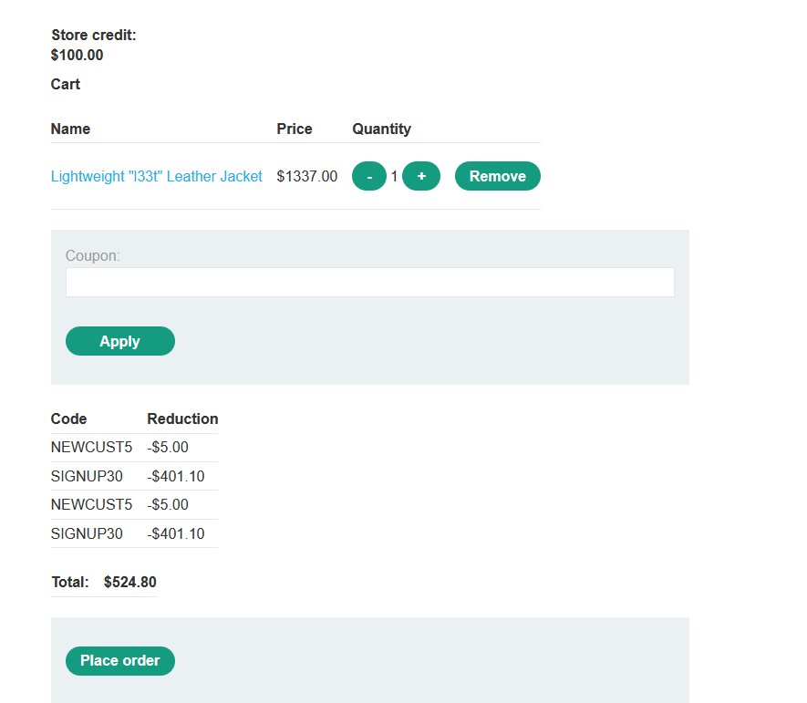
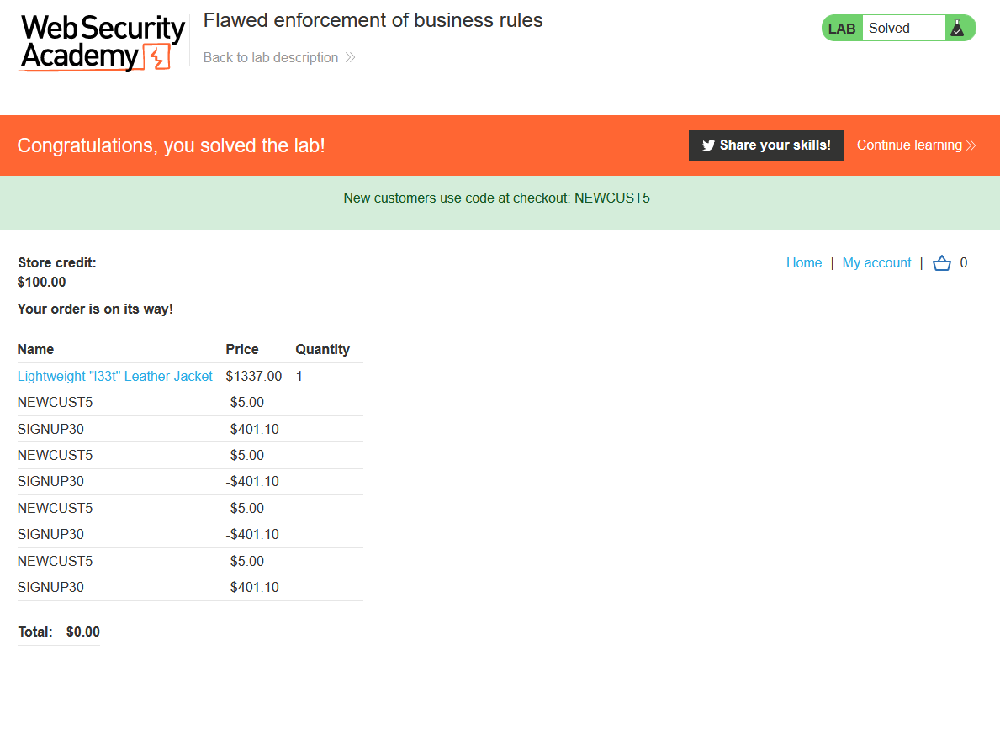

### Giải quyết
- Như mô tả, trang web chứa lỗ hổng trong quá trình mua hàng.
- Đầu tiên xem xét website bán hàng này.
    - Khi truy cập trang web người dùng sẽ được tặng 1 coupon giảm giá `New customers use code at checkout: NEWCUST5`. Tuy nhiên nó chỉ có thể giảm được `5$`, giá sản phẩm sau khi đã giảm vẫn rất cao so với số dư có trong tài khoản.
    
    - Quay lại trang chính, bên dưới có 1 chức năng đăng ký j đó
    
    - Sau khi thử đăng ký, người dùng sẽ nhận được 1 coupon nữa 
    
    - Tuy nhiên nó cũng chỉ giảm thêm được `$401.10`, số tiền vẫn khá lớn.
    - Tiếp đến, thử sử dụng lại các coupon đã áp dụng trước đó. Không thể áp dụng coupon `SIGNUP30` vừa sử dụng.
    
    - Tuy nhiên lại có thể sử dụng được coupon đầu tiên. Thử tiếp và áp được coupon `SIGNUP30` 
    
    => Chức năng này chỉ kiểm tra và không cho phép áp dụng coupon vừa sử dụng => có thể sử dụng sole 2 coupon.
    
###### Solved!
