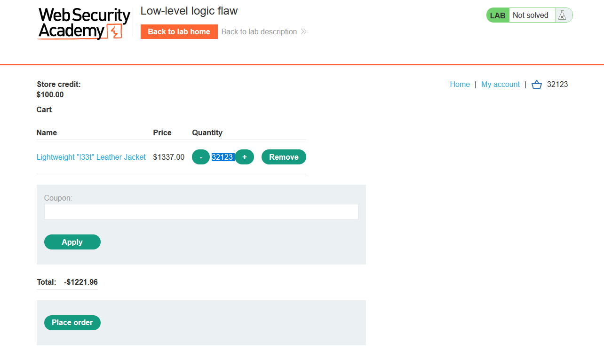
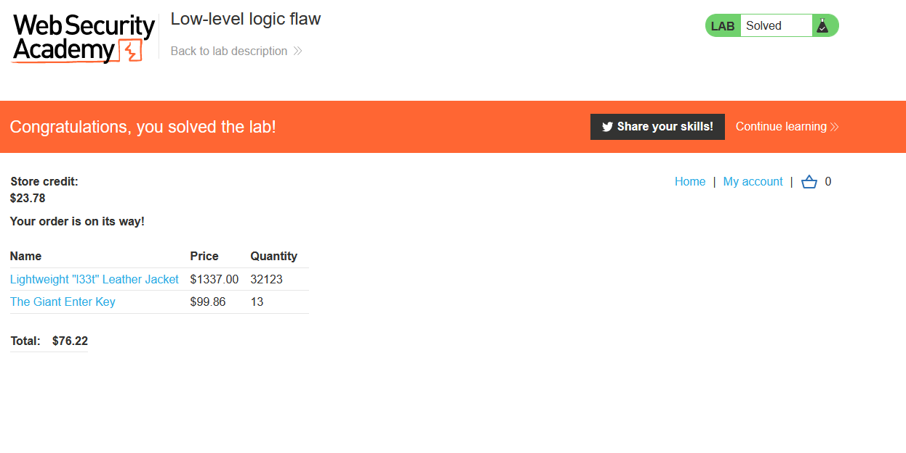

### Giải quyết
- Vẫn là lỗ hổng trong quá trình mua hàng vì phòng thí nghiệm này không xác thực đầy đủ đầu vào của người dùng tuy nhiên không đơn giản như những lab trước. Chỉ có vị trí số lượng sản phẩm khi thêm vào giỏ hàng có thể khai thác nhưng không thể đặt số lượng sản phẩm < 0 vì khi đó giỏ hàng sẽ thông báo rỗng.
- Sau cùng mình đã thử `integer overflow`, thử làm tràn tổng giá trị phải thanh toán bằng cách thay đổi số lượng sản phẩm trong giỏ hàng. Tuy nhiên mỗi lần chỉ được thêm tối đa 99 sản phẩm vào giỏ nhưng số lượng sản phẩm trong giỏ không bị giới hạn.

- Vì thế có thể sử dụng Burp Intruder để lặp lại việc thêm tối đa sản phẩm vào giỏ hàng.

- Khi đến hơn 16k sản phẩm, tổng giá trị đã bị tràn.

- Nhưng không thể thanh toán khi giá trị nhỏ hơn 0 nên lại cần thêm
1 lượng sản phẩm, khi đó tổng giá trị sẽ tăng dần đến 0. 

- Thêm 1 số sản phầm khác để tổng giá trong khoảng có thể thanh toán.

###### Solved!
