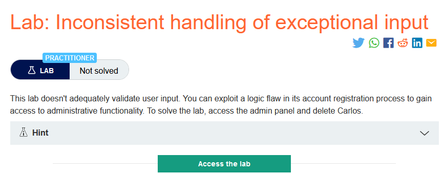
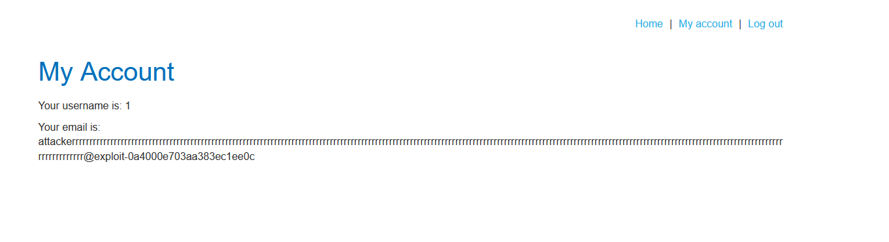
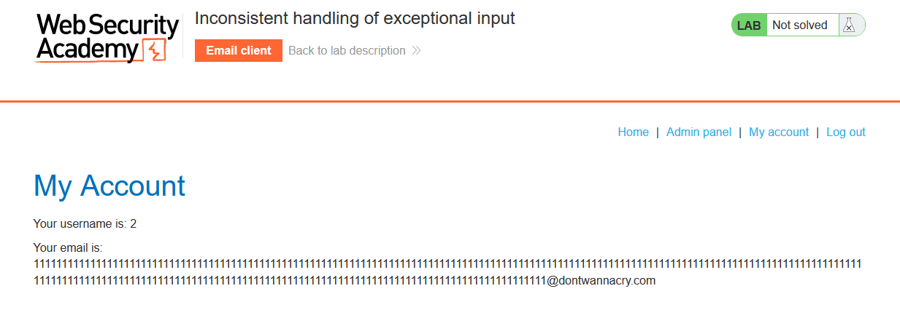
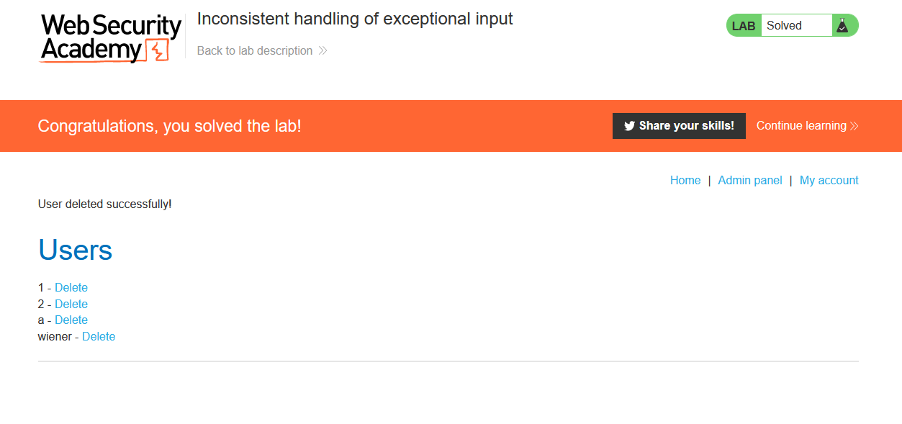

### Giải quyết
- Vẫn là lỗ hổng trong quy trình đăng ký tài khoản do phòng thí nghiệm không xác thực đầy đủ đầu vào của người dùng.
- Sau một hổi thử các trường hợp của mail đăng ký, khi tình cờ nhập linh tinh 1 đoạn mail dài thì sau khi đăng ký và đăng nhập thành công, mail hiển thị đã bị cắt mất 1 đoạn phía sau. 
- Đoạn mail hiển thị chỉ chứa tối đa 255 ký tự

- Hơn nữa có hint: `The client will display all messages sent to @YOUR-EMAIL-ID.web-security-academy.net and any arbitrary subdomains`. Tức là kể cả sử dụng tên miền phụ tùy ý cũng có thể gửi được mail đến `email client` => sử dụng mail với 255 ký tự tính từ đầu đến hết tên miền phụ cần sử dụng `1111111111111111111111111111111111111111111111111111111111111111111111111111111111111111111111111111111111111111111111111111111111111111111111111111111111111111111111111111111111111111111111111111111111111111111111111111111111111111111111@dontwannacry.com`.exploit-0a4000e703aa383ec1ee0c5601f800f6.exploit-server.net
- Thành công đăng ký và đăng nhập.

###### Solved!
