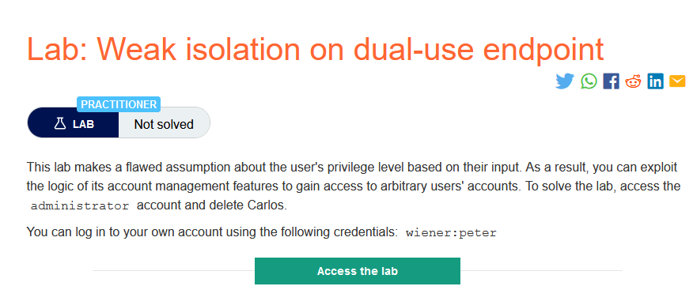
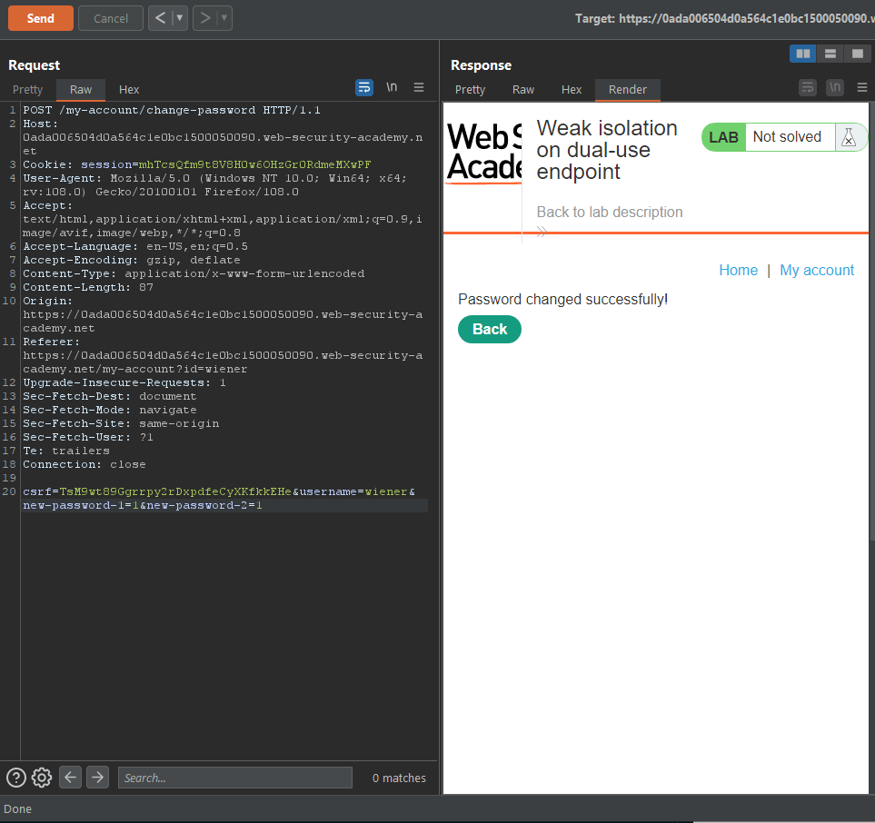
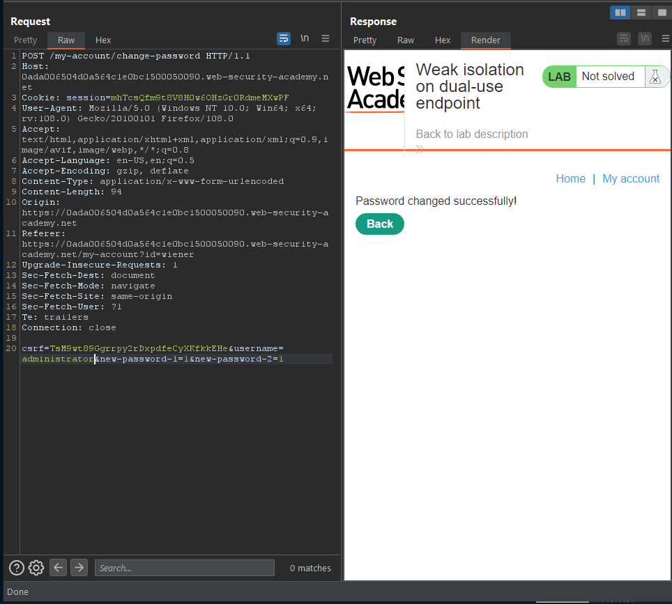
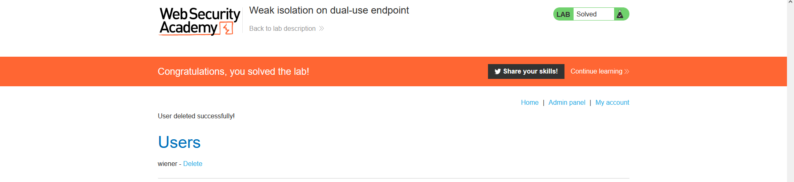

### Giải quyết
- Sau vài lần thử nghiệm chức năng thay đổi mật khẩu người dùng bằng tài khoản `wiener` được cung cấp => phát hiện chức năng thay đổi mật khẩu của ứng dụng chỉ kiểm tra tham số trường `Current password` mà không kiểm tra có trường đó hay không.
- Vì vậy có thể dễ dàng thay đổi mật khẩu người dùng mà không cần `Current password`.
- Thử nghiệm trên user được cấp.

- Thay đổi mất khẩu user administrator.

###### Solved!
