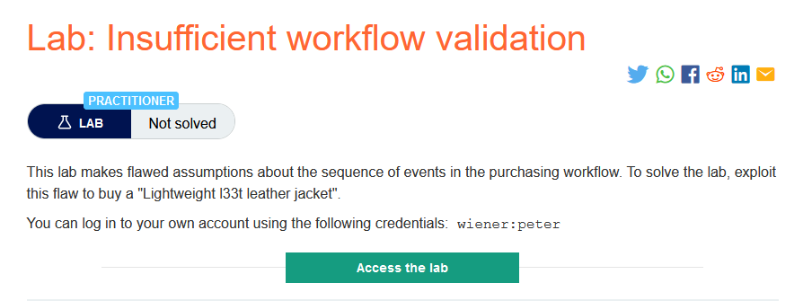
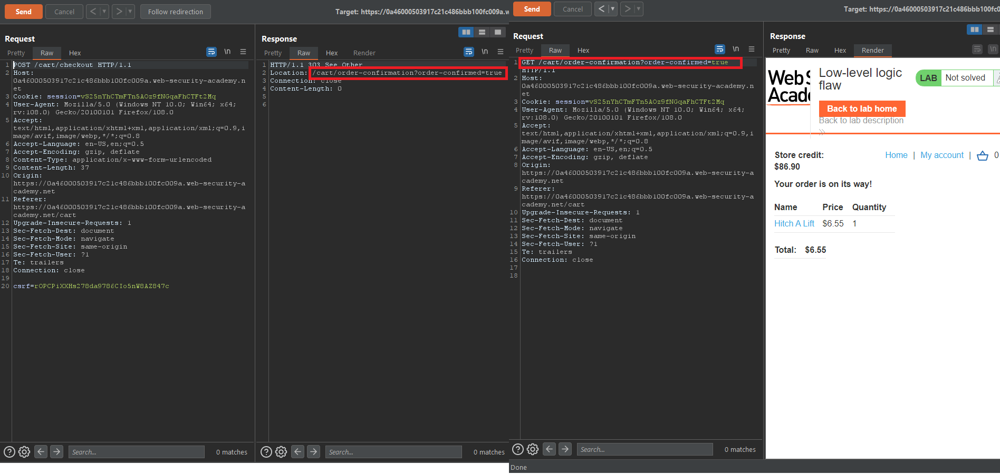
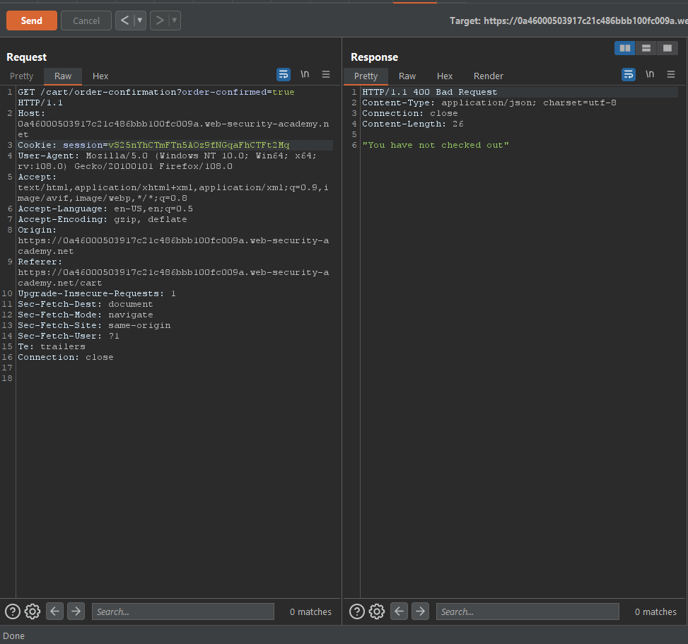
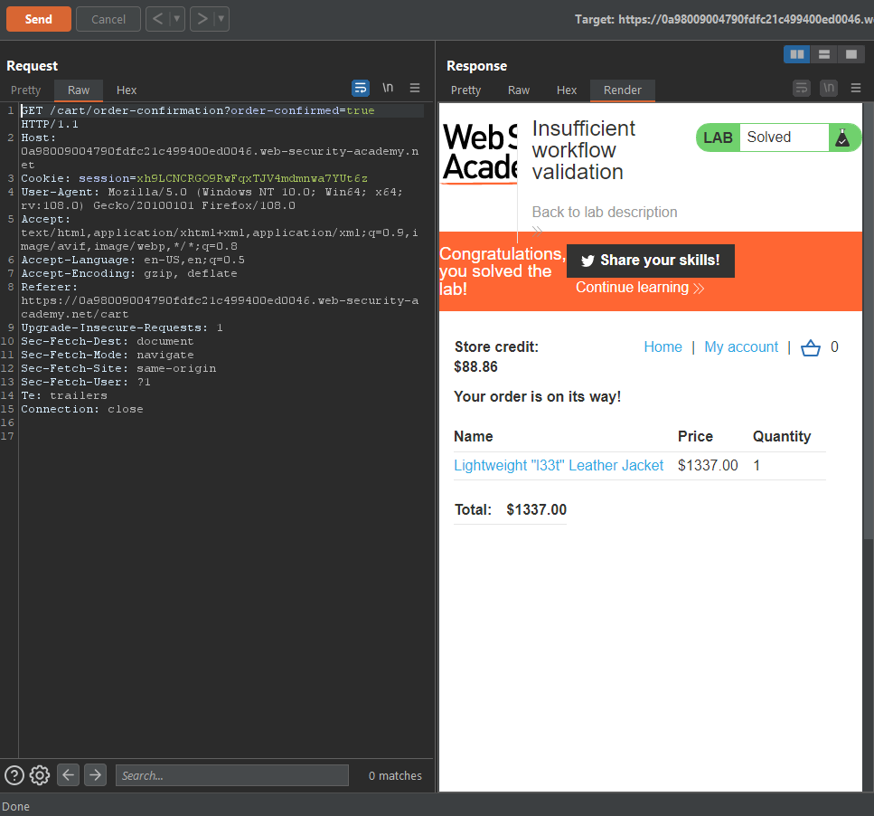

### Giải quyết
- Phân tích tiến trình mua hàng bình thường: 
    - Người dùng sau khi thêm hàng vào giỏ hàng và tiến hành đặt hàng sẽ có 1 request checkout được gửi đi.
    - Nếu người mua đủ tiền chả cho món hàng, ứng dụng sẽ chuyển hướng tới request cuối cùng và đặt hàng thành công như sau:
    
    - Trong trường hợp logic bình thường người dùng sẽ không thể gửi request cuối cùng kia nếu chưa checkout.
    
- Quay trở lại với lab hiện tại, ứng dụng đã cho phép request cuối cùng trong quá trình đặt hàng được phép thực hiện chỉ cần có sản phầm trong giỏ hàng ngay cả khi chưa checkout. Đó là sai lầm trong logic ứng dụng ở lab này và người dùng có thể lợi dụng nó để mua hàng ngay cả khi số tiền hàng vượt quá số tiền có trong tài khoản.

###### Solved!

