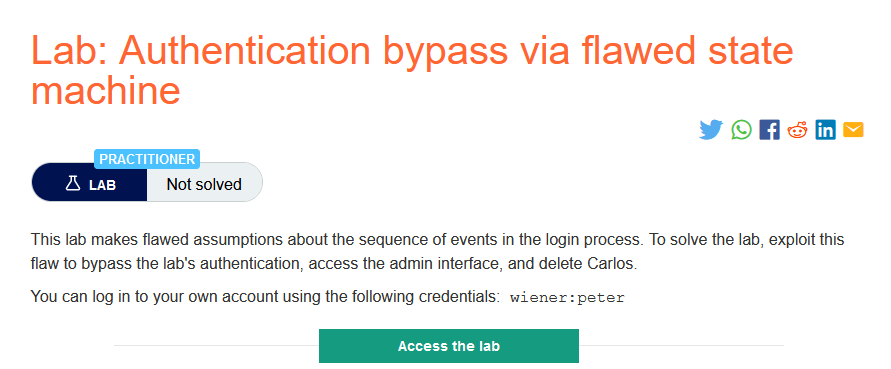
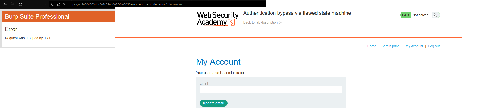
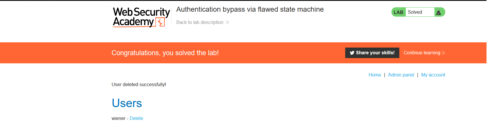

### Giải quyết
- Phân tích quá trình đăng nhâp:
    - Sau khi đăng nhập thành công người dùng sẽ được chuyển đến chức năng chon vai trò mà họ muốn tương tác với ứng dụng web bao gồm `user và content author` 
- Tại bước chọn role, thử sửa giá trị `role` thành `admin hoặc administrator` nhưng không thành công.
- Vì vậy, mình đã thử drop bước chọn role sau khi đăng nhập thành công và chuyển luôn đến trang `my-account` để xem role mặc định được set là gì.
- Drop `role-select` và truy cập đến `my-account`.

`=> role mặc định là admin `

###### Solved!