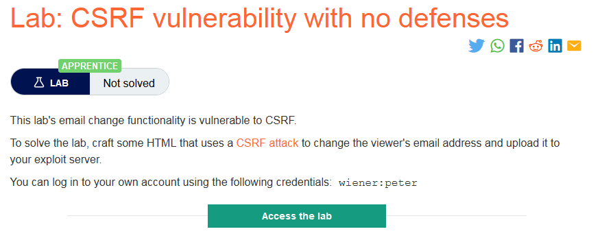
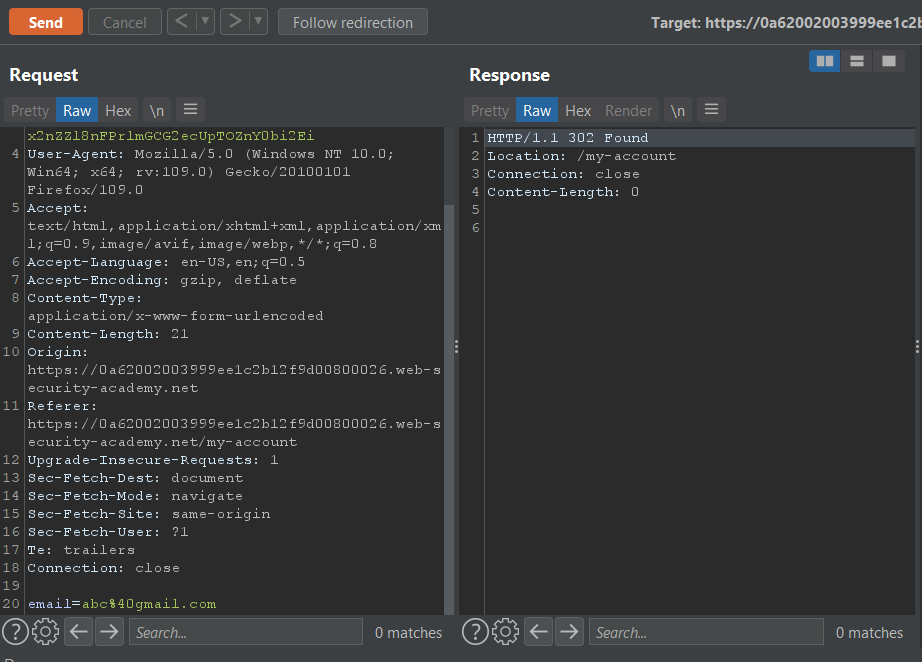
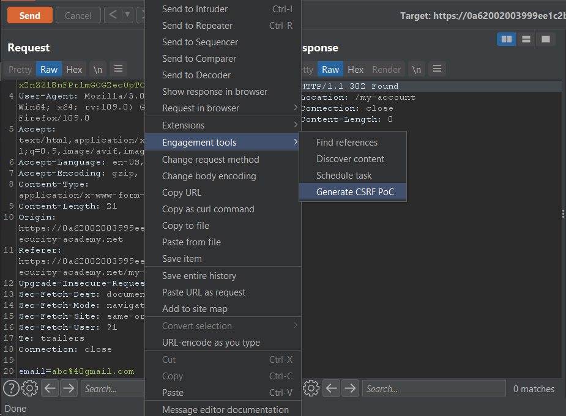
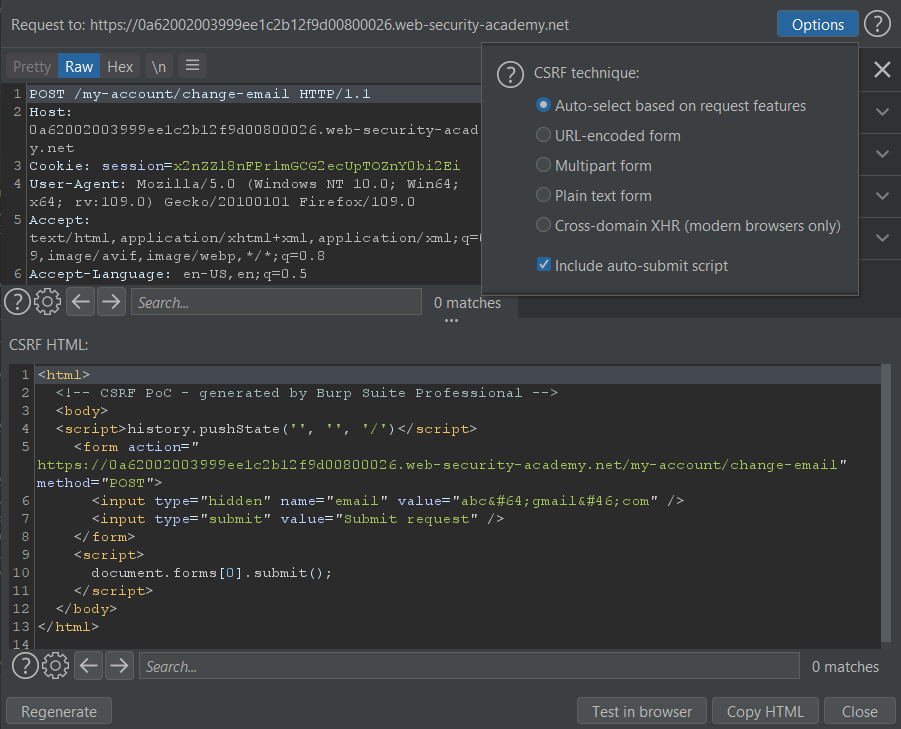
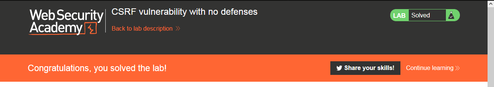

### Giải quyết
- Phòng thí nghiệm chứa có chức năng thay đổi email dễ bị tấn công CSRF.
- Trước tiên truy cập phòng thí nghiệm và thử chức năng thay đổi email của `wiener` và xem request trong Burp

- Có vẻ như trang web chỉ sử dụng session cookie để xác định tài khoản mà không có tính năng bổ sung nào để bảo vệ.
- Vì vậy để tấn công CSRF chỉ cần 1 form giống với form thay đổi email và tự động submit khi được xem.
- Đơn giản nhất có thể sử dụng Generate CSRF PoC của Burp pro

- Để tự động submit tích chọn `Include auto-submit script` 

- Sau đó ném nó lên exploit server, store và `Deliver exploit to victim` 
- Để kiểm tra có thể `View exploit` nếu email thay đổi là thành công

###### Solved!
