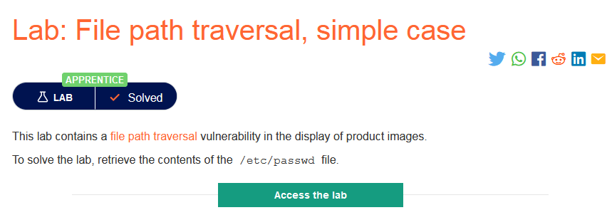
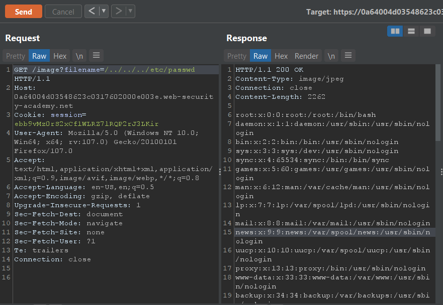

### Mô tả
> Phòng thí nghiệm này chứa lỗ hổng bảo mật file path traversal khi hiển thị hình ảnh sản phẩm.
Để giải quyết phòng thí nghiệm, hãy truy xuất nội dung của file /etc/passwd. 
### Giải quyết
- Bắt request khi mở hình ảnh sản phẩm và chuyển tới Burp Repeater.
- Thay đổi giá trị filename thành `../../../etc/passwd` và send request.

###### Solved!