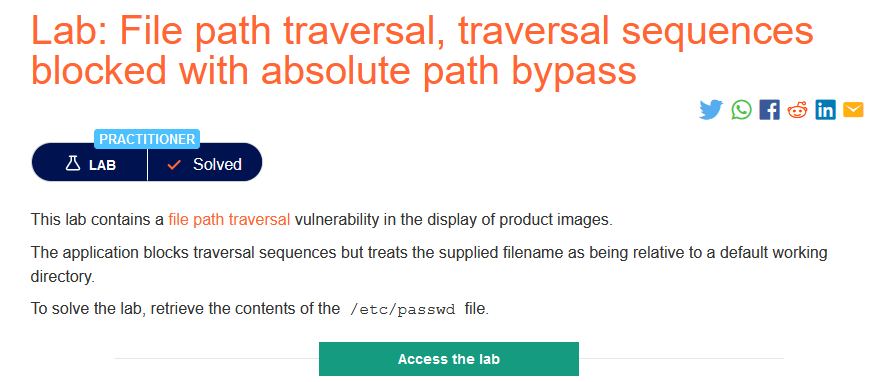
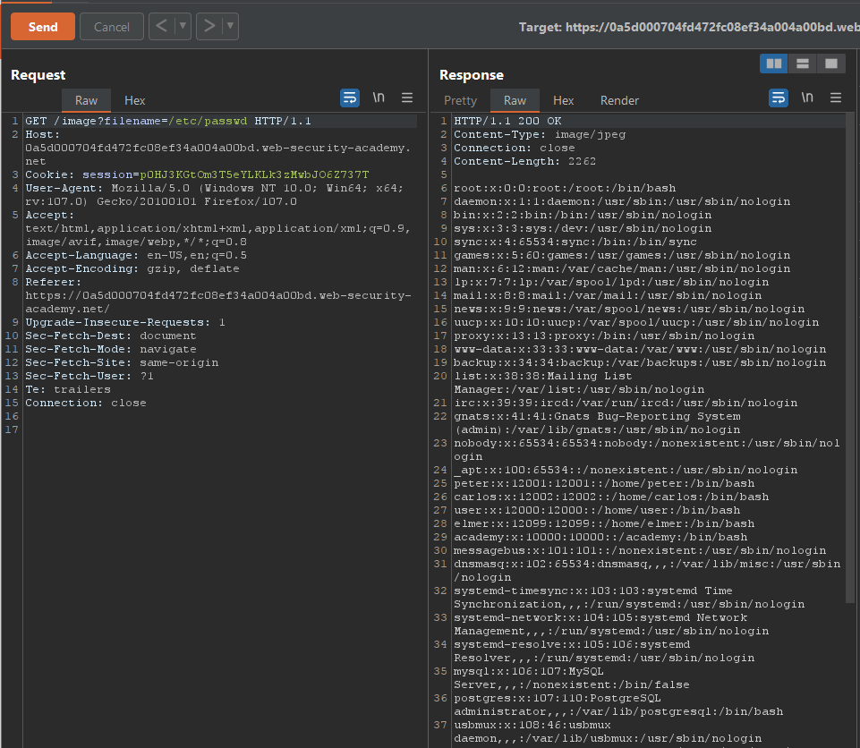

### Giải quyết
- Gợi ý trong phần mô tả phòng thí nghiệm, 'tên tệp được coi là tương đối so với thư mục làm việc mặc định'. Vì vậy chỉ cần thay đổi giá trị tham số `filename` thành `/etc/passwd`.

###### Solved!
