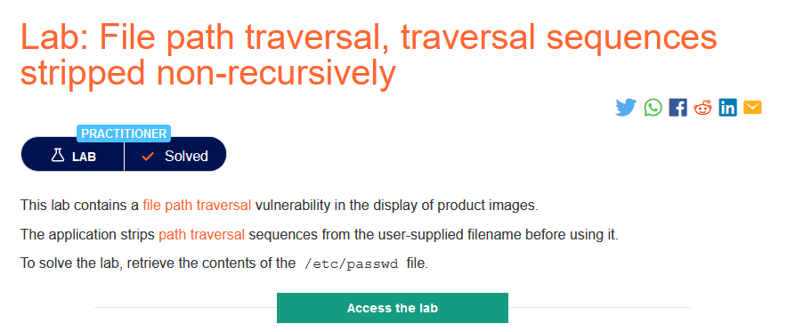
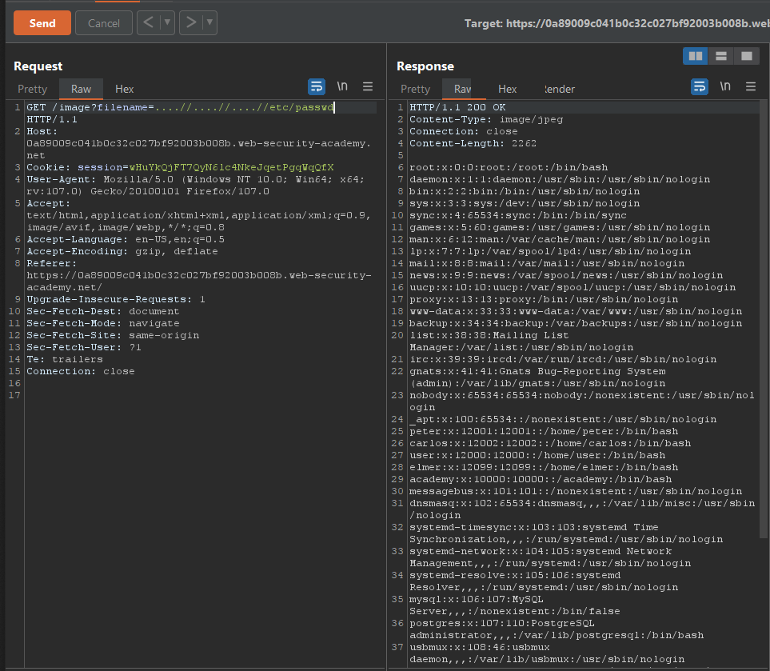

### Giải quyết 
- Gợi ý trong mô tả lab cho biết trang web đã lọc bỏ các ký tự `../` nhưng vì nó `non-recursively - không đệ quy` nên có thể dễ dàng bypass bộ lọc này bằng cách sử dụng `....//`.

###### Solved!
