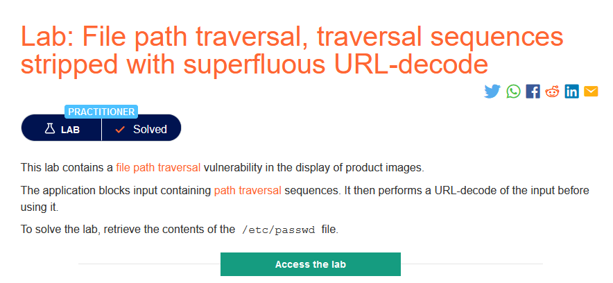
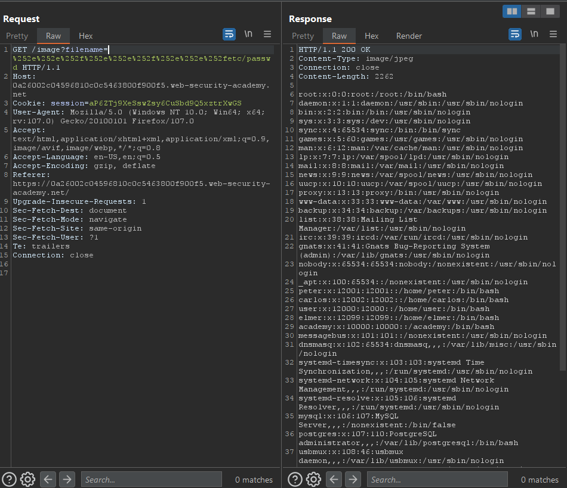

### Mô tả
> Phòng thí nghiệm này chứa lỗ hổng bảo mật truyền tải đường dẫn tệp khi hiển thị hình ảnh sản phẩm.
Ứng dụng chặn đầu vào chứa các trình tự truyền tải đường dẫn. Sau đó, nó thực hiện giải mã URL của đầu vào trước khi sử dụng.
Để giải bài lab, hãy truy xuất nội dung của tệp /etc/passwd.
### Giải quyết
- Mô tả cho biết, ứng dụng chặn đầu vào chứa các trình tự truyền tải đường dẫn. Sau đó, nó thực hiện giải mã URL của đầu vào trước khi sử dụng.
- Vì thế có thể sử dụng mã hóa URL để vượt qua bộ lọc:
`../../../etc/password -> %252e%252e%252f%252e%252e%252f%252e%252e%252fetc/passwd` 

