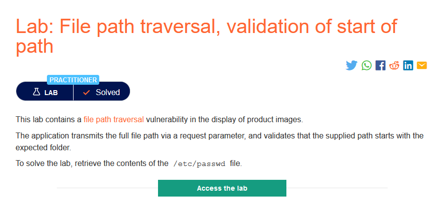
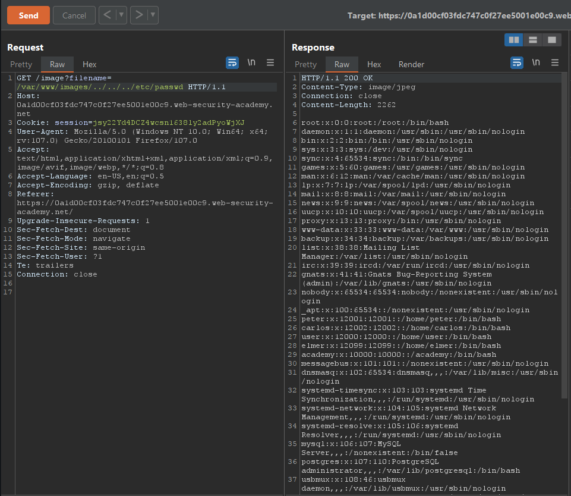

### Giải quyết
- Ứng dụng kiểm tra xem đường dẫn có bắt đầu với các giá trị dự kiến ​​hay không, trong trường hợp này là đường dẫn tuyệt đối `/var/www/images`, vì vậy không thể dùng đường dẫn tuyệt đối như `/etc/passwd` mà có thể dùng đường dẫn tương đối `/var/www/images/../../../etc/passwd`.
 
###### Solved!