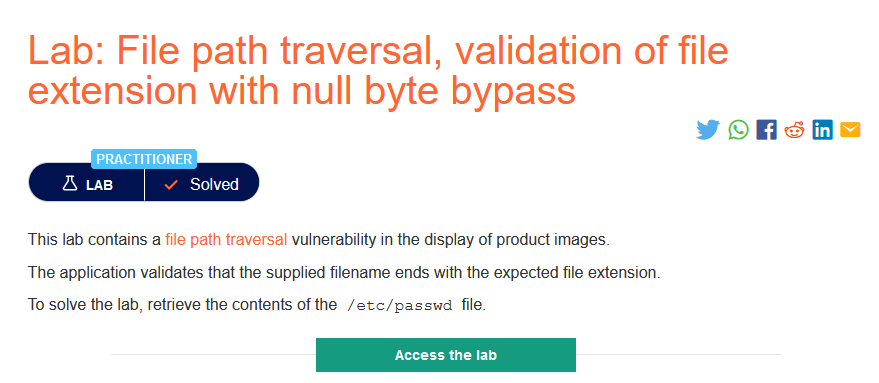
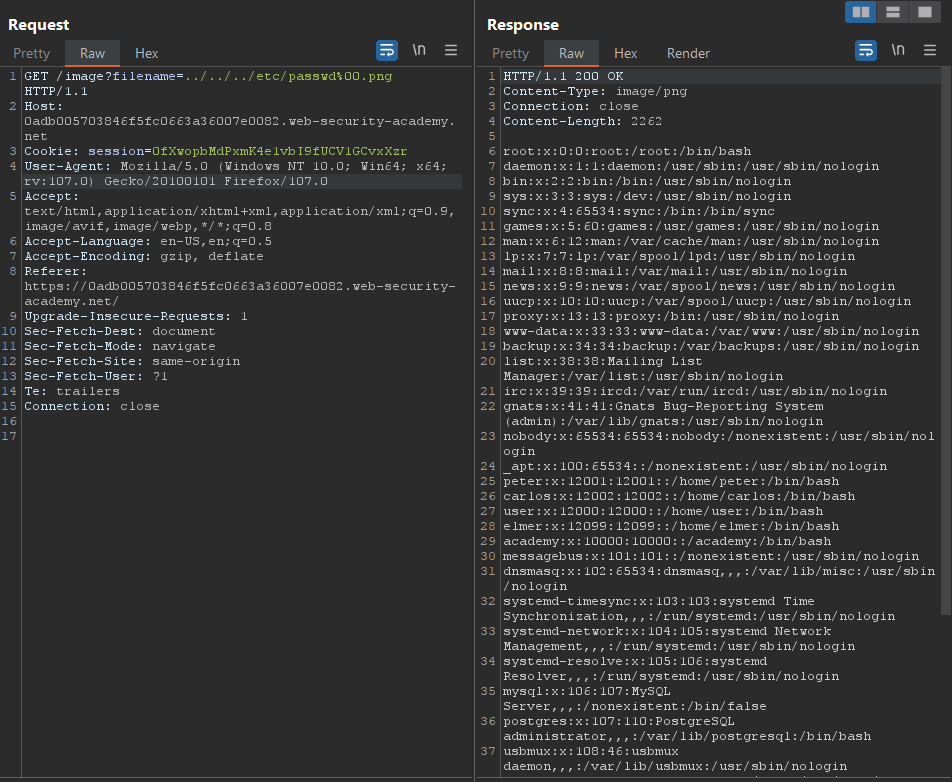

### Mô tả
> Phòng thí nghiệm này chứa lỗ hổng bảo mật truyền tải đường dẫn tệp khi hiển thị hình ảnh sản phẩm.
Ứng dụng xác thực rằng tên tệp được cung cấp kết thúc bằng phần mở rộng tệp dự kiến.
Để giải bài lab, hãy truy xuất nội dung của tệp /etc/passwd.
### Giải quyết
- "Ứng dụng xác thực rằng tên tệp được cung cấp kết thúc bằng phần mở rộng tệp dự kiến", trong trường hợp này là phần mở rộng tệp hình ảnh `.png, .jpg`
- Vì vậy có thể vượt qua bô lọc này bằng cách thêm null byte trước phần mở rộng tệp.

###### Solved!