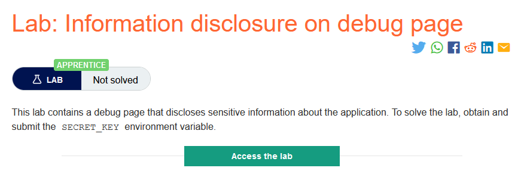
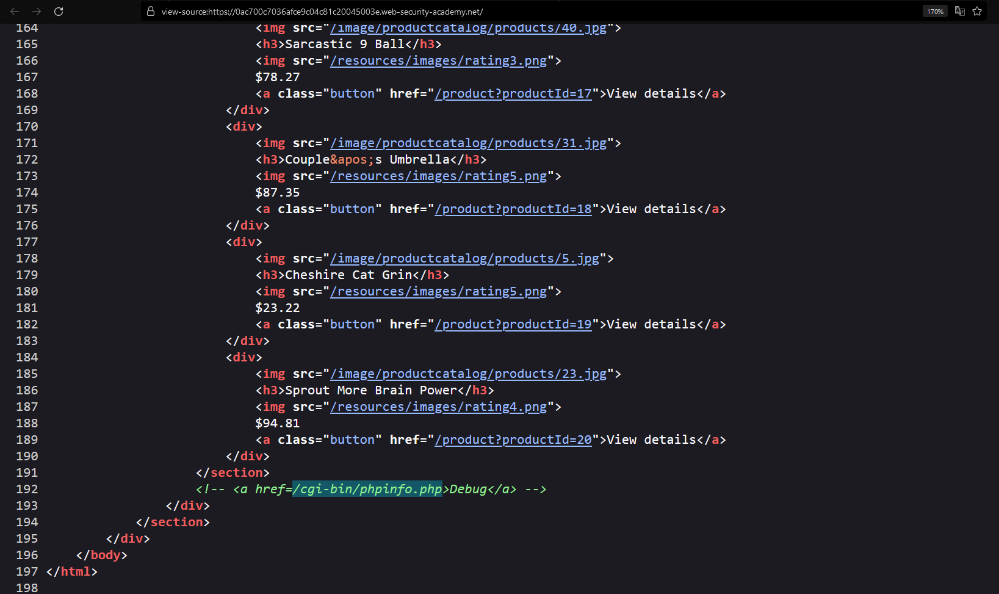
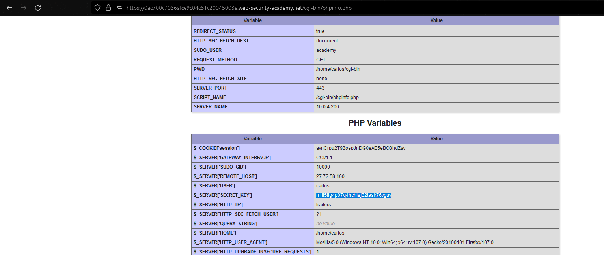

### Giải quyết
- Mô tả cho biết, phòng thì nghiệm chứa 1 trang debug chứa thông tin nhạy cảm, cần tìm ra trang đó và submit `SECRET_KEY`
- Tại trang chủ, `View page source` sau đó bên dưới có 1 đường dẫn tới `debug page` bị comment. 

- Truy cập đường dẫn lấy `SECRET_KEY` và submit

###### Solved!