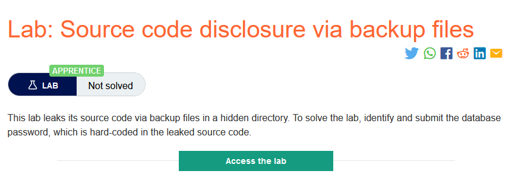
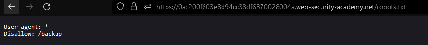
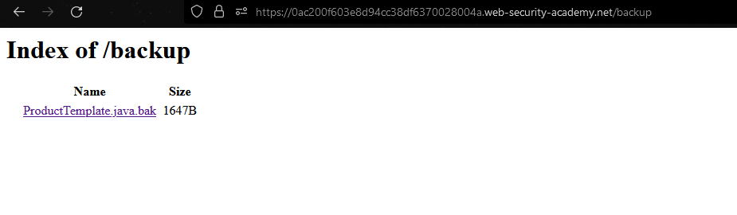
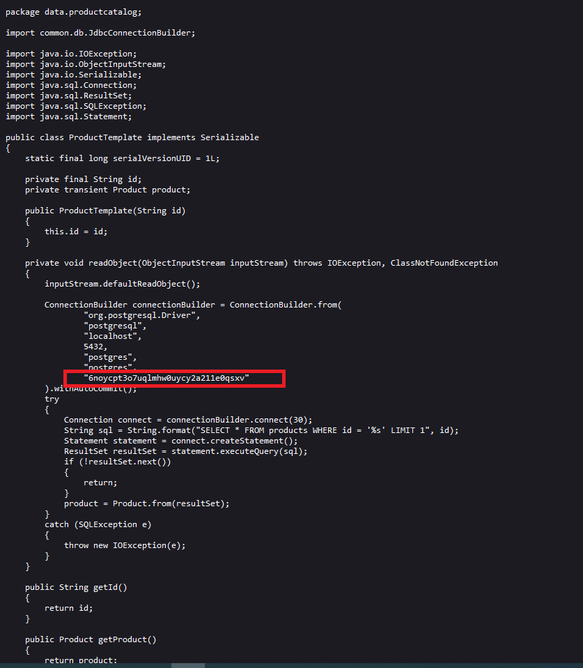

### Giải quyết
- Kiểm tra file `robots.txt` có 1 đường dẫn tới trang backup.

- Truy cập theo đường dẫn tới trang backup có 1 source code.

- Lấy mật khẩu được mã hóa bị rò rỉ trong source code và submit.

###### Solved!
