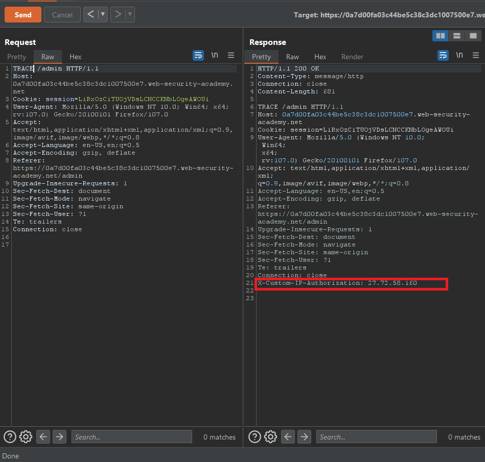

### Giải quyết
- Sau khi đăng nhập, truy cập trang admin và nhận được thông báo ` Admin interface only available to local users `
- Thay đổi HTTP method, đến TRACE method trả về response chứa 1 custom HTTP header

- Giờ đã biết header cần sử dụng, thiết lập nó để được gửi cùng mỗi request bên tab Proxy.

- Truy cập lại trang admin và xóa tài khoản carlos.

###### Solved!