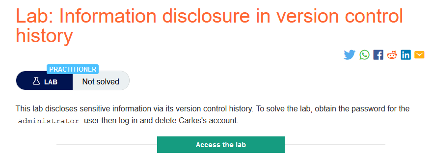
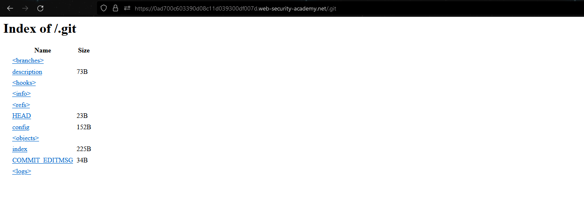
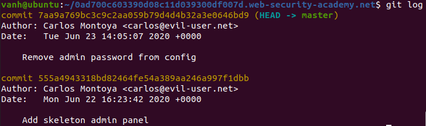
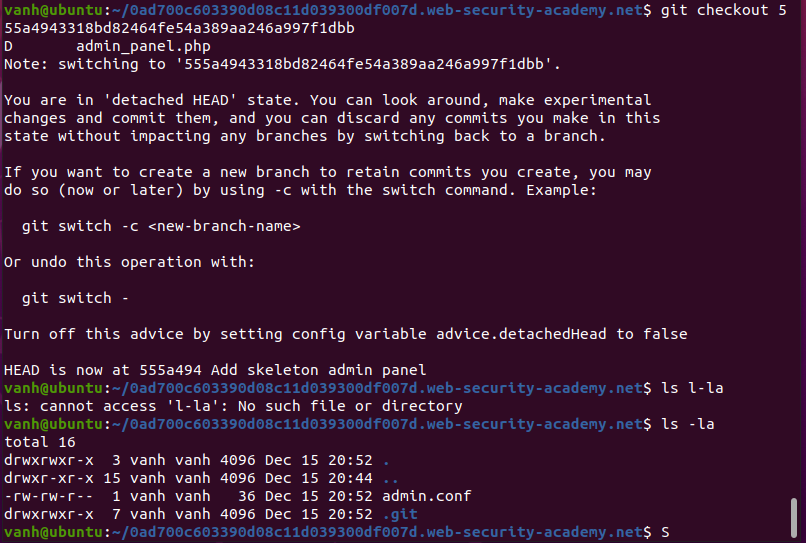
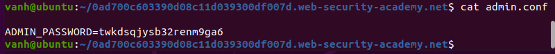
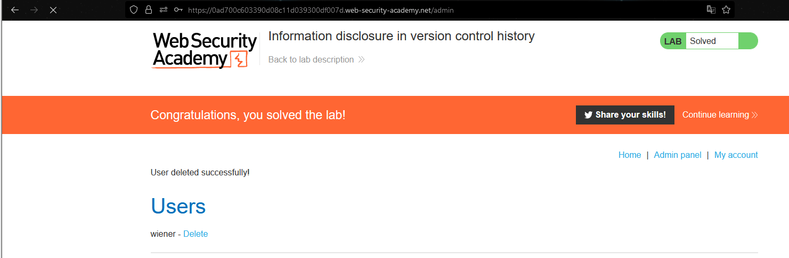

### Giải quyết
- Phòng thí nghiệm chứa thông tin nhạy cảm trong lịch sử kiểm soát phiên bản => .git

- Sao chép thư mục về bằng wget:
`wget --mirror -I .git https://0ad700c603390d08c11d039300df007d.web-security-academy.net/.git`
- Check git log:

- Thông báo `Remove admin password from config` từ commit cuối cùng. Vì vậy check commit trước đó.

- Đọc file admin.conf -> password

- Đăng nhập tài khoản `administrator` và xóa tài khoản carlos

###### Solved!
