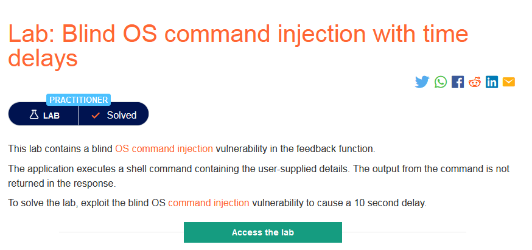

### Mô tả
> Lab này chứa lỗ hổng blind OS command injection trong chức năng phản hồi.
Ứng dụng thực thi shell command  chứa các chi tiết do người dùng cung cấp. Đầu ra từ lệnh không được trả lại trong phản hồi.
Để giải quyết vấn đề trong phòng thí nghiệm, hãy khai thác lỗ hổng chèn lệnh mù của hệ điều hành để gây ra độ trễ 10 giây
### Giải quyết
- Mô tả cho biết lab chứa lỗ hổng blind OS command injection trong chức năng feedback.
- Để gây ra độ trễ có thể dùng lệnh `sleep`.
- Sau khi thử chèn lệnh vào các trường trong form feedback thì chỉ có trường email chứa lỗ hổng blind OS command injection.

###### Solved! 